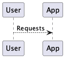

# Requirements and Design

## 1. Change History

| **Change Date**   | **Modified Sections** | **Rationale** |
| ----------------- | --------------------- | ------------- |
| _Nothing to show_ |

---

## 2. Project Description

[WRITE_PROJECT_DESCRIPTION_HERE]

---

## 3. Requirements Specification

### **3.1. List of Features**

### **3.2. Use Case Diagram**

### **3.3. Actors Description**
1. **[WRITE_NAME_HERE]**: ...
2. **[WRITE_NAME_HERE]**: ...

### **3.4. Use Case Description**
- Use cases for feature 1: [WRITE_FEATURE_1_NAME_HERE]
1. **[WRITE_NAME_HERE]**: ...
2. **[WRITE_NAME_HERE]**: ...
- Use cases for feature 2: [WRITE_FEATURE_2_NAME_HERE]
3. **[WRITE_NAME_HERE]**: ...
4. **[WRITE_NAME_HERE]**: ...
...

### **3.5. Formal Use Case Specifications (5 Most Major Use Cases)**

#### Use Case 1: [WRITE_USE_CASE_1_NAME_HERE]

**Description**: ...

**Primary actor(s)**: ... 
    
**Main success scenario**:
1. ...
2. ...

**Failure scenario(s)**:
- 1a. ...
    - 1a1. ...
    - 1a2. ...

- 1b. ...
    - 1b1. ...
    - 1b2. ...
                
- 2a. ...
    - 2a1. ...
    - 2a2. ...

...

#### Use Case 2: [WRITE_USE_CASE_2_NAME_HERE]
...

### **3.6. Screen Mock-ups**

### **3.7. Non-Functional Requirements**

1. **[WRITE_NAME_HERE]**
    - **Description**: ...
    - **Justification**: ...
2. ...

---

## 4. Designs Specification
### **4.1. Main Components**
1. **[WRITE_NAME_HERE]**
    - **Purpose**: ...
    - **Interfaces**: 
        1. ...
            - **Purpose**: ...
        2. ...
2. ...

### **4.2. Databases**
1. **[WRITE_NAME_HERE]**
    - **Purpose**: ...
2. ...

### **4.3. External Modules**
1. **[WRITE_NAME_HERE]** 
    - **Purpose**: ...
2. ...

### **4.4. Frameworks**
1. **[WRITE_NAME_HERE]**
    - **Purpose**: ...
    - **Reason**: ...
2. ...

### **4.5. Dependencies Diagram**

### **4.6. Use Case Sequence Diagram (5 Most Major Use Cases)**
1. [**[WRITE_NAME_HERE]**](#uc1)\

[SEQUENCE_DIAGRAM_HERE]
2. ...

### **4.7. Design and Ways to Test Non-Functional Requirements**
1. [**[WRITE_NAME_HERE]**](#nfr1)
    - **Validation**: ...
2. ...
