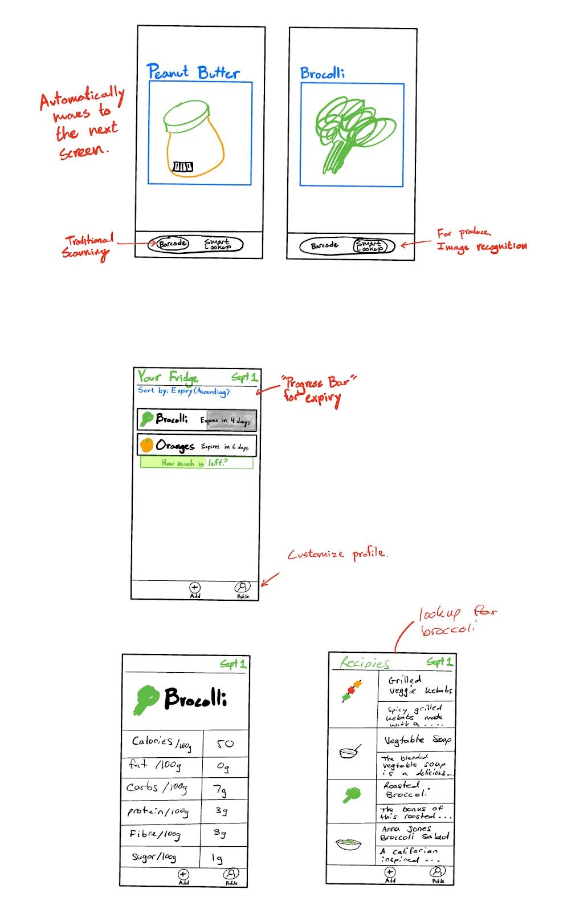
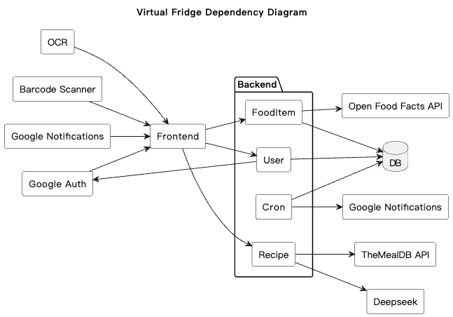
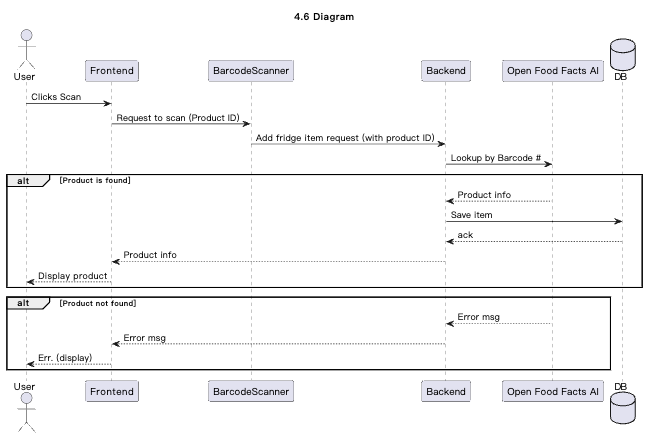
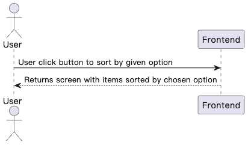
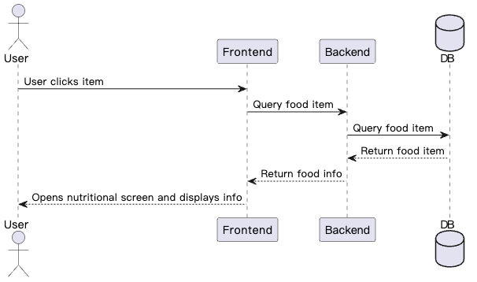

# Requirements and Design

## 1. Change History

| **Change Date**   | **Modified Sections** | **Rationale** |
| ----------------- | --------------------- | ------------- |
| 20/09/25          | Initial Commit

---

## 2. Project Description
Virtual Fridge is a smart companion for your kitchen, designed to help you stay organized, reduce food waste, and make healthier choices. By scanning barcodes, the app automatically tracks what products you've bought and keeps an up-to-date inventory of what's in your fridge. It sends timely notifications when items are nearing their expiration date, ensuring you use them before they go bad.

Beyond just tracking, Virtual Fridge helps you get the most out of your groceries. It suggests recipes based on the ingredients you already have, helping you save money while minimizing waste. You can also view detailed nutritional information for the foods in your fridge, making it easier to plan balanced meals. With Virtual Fridge, your kitchen becomes smarter, your meals more creative, and your lifestyle more sustainable.

---

## 3. Requirements Specification

### **3.1. List of Features**
1. **Authentication**: To access the app, users must complete a Google authentication process. A user must create an account with our app through their Google account. Users can sign out and delete their accounts, but cannot sign up multiple times with the same Google account

2. **Log Food**: The user can add their food to the app by scanning the aforementioned food. If the food has a barcode, the user can click a button on the home page to bring up a barcode scanner used to get the information from the food. Without a barcode, the user can take a picture of the item to log. If that logging fails, or gives an item that is incorrect, the user can select from a pre-made list. 

3. **View Fridge**: The user can see a home page listing all the scanned items. They are able to sort the food by different metrics, such as by expiration date, added date or by nutritional values. 

4. **Get Recipes**: The user can find recipes using one or more ingredients in their virtual fridge. After selecting the items on the home screen, the user can ask for recipes, in which they will receive a small list of recipe overviews which can be clicked on for more details surrounding more ingredients needed and cooking instructions. Generate recipes automatically with items in the fridge for the user to select if the user does not select any item.

5. **Get Nutrition**: The user can click on any item in their fridge and get the nutritional value for said item. There will be a new screen that appears showing nutritional facts such as calories, fat, carbs and protein.

6. **Expiry Notification**: Send notification to the user to alert them for expiring items. The user can configure the timing to get a notification when their food begins to expire. For example, the user could ask for 48 hours notice, giving them a notification 48 hours before any of the food in their fridge expires.

### **3.2. Use Case Diagram**


### **3.3. Actors Description**
1. **Users**: The users of the virtual fridge application are individuals and households who want to manage their food inventory more efficiently. They rely on the app to keep track of what items are currently in their fridge or pantry, monitor expiration dates, reduce food waste, and plan meals based on available ingredients. Users may include busy professionals, students, families, or anyone looking for convenience, organization, and cost savings in their daily food management.

2. **Barcode Scanner**: A module that scans a barcode and retrieves the ID of the associated product.

3. **Gemini API**: Google's AI service that processes images of food items to identify and classify them. When given an image, Gemini analyzes the visual content and determines what food item is present, if any.

4. **The MealDB API**: An API that returns structured recipe data based on passed in parameters like ingredients.

5. **Open Food Facts API**: An API that returns nutritional data, images, product name, ingredients, and product ID based on passed in parameters.

6. **Gemini API (AI)**: Google's AI service that generates creative and personalized recipe suggestions based on available ingredients using advanced language models.

7. **Google Authentication**: The authentication module provided by Google. This handles Users logging in or otherwise managing their profile using their Google account.

### **3.4. Use Case Description**
- Use cases for feature 1: Authentication
1. **Sign Up with Google**: Users create an account for the virtual fridge application by linking their Google account. Each Google account can only be registered once.
2. **Sign In with Google**: Users access the application by authenticating with their Google account credentials.
3. **Sign Out**: Users can securely log out of the application at any time.  
4. **Delete Account**: Users can permanently remove their account from the system, after which their associated data will be deleted. 
- Use cases for feature 2: Log Food
5. **Log Food via Barcode**: Users can scan the barcode of a food item using the in-app barcode scanner to automatically retrieve and log details such as name, brand, and nutritional information.
6. **Log Food via Image**: Users can take a photo of a food item without a barcode, and the app will use Gemini API to identify and log the item.
7. **Log Food via Pre-Made List**: Users can manually select a food item from a curated list within the app to quickly add common items. 
- Use cases for feature 3: View Fridge
8. **View Food Inventory**: Users can access the home page to see a list of all logged food items currently in their virtual fridge.  
9. **Sort by Expiration Date**: Users can sort items to view which foods are closest to expiring, helping to reduce waste.  
10. **Sort by Added Date**: Users can sort items based on when they were logged into the system.  
- Use cases for feature 4: Get Recipes
11. **Generate Recipe Suggestions**: Users can request recipes, and the app provides a list of possible recipe overviews based on the selected ingredients, or, if the user does not select any items, a selection of ingredients that will expire soon.  
12. **View Recipe Details**: Users can click on a recipe overview to see more detailed information, including additional required ingredients, step-by-step cooking instructions, and preparation time.
- Use cases for feature 5: Get Nutrition
13. **View Nutritional Facts**: The app displays a new screen showing nutritional information such as calories, fat, carbohydrates, and protein.  

### **3.5. Formal Use Case Specifications (5 Most Major Use Cases)**
<a name="uc1"></a>

#### Use Case 1: Log Food via Image

**Description**: Users add a food item to their virtual fridge by taking a photo of a food item without a barcode, and the app uses Gemini API to identify and log the item.

**Primary actor(s)**: User, Gemini API, Open Food Facts API

**Main success scenario**:
1. User selects "Add Food" and chooses the image capture option.
2. User takes a photo of the food item using the in-app camera.
3. System sends the image to Gemini API for identification.
4. Gemini API analyzes the image and identifies the food item.
5. System retrieves additional details (nutritional info, estimated expiration) from Open Food Facts API using the identified food name.
6. User reviews the identified food item details.
7. User clicks "Confirm".
8. System adds the food item to the user's fridge inventory.

**Failure scenario(s)**:
- 1a. Image is too blurry or lighting is insufficient.
  - 1a1. Gemini API returns low confidence result or error.
  - 1a2. System displays error and prompts user to retake the photo.

- 2a. Gemini API cannot identify the item as food.
  - 2a1. System notifies user that the image does not appear to contain food.
  - 2a2. System offers alternative methods (barcode scan or manual selection from pre-made list).

- 3a. Multiple food items detected in the image.
  - 3a1. Gemini API returns multiple possible food items.
  - 3a2. System prompts user to select which item they want to add or retake photo with single item.

- 4a. Network connection unavailable or Gemini API is unreachable.
  - 4a1. System displays error message: "Unable to process image. Please check your connection and try again."  

<a name="uc2"></a>

#### Use Case 2: Log Food via Barcode

**Description**: Users add a food item to their virtual fridge by scanning its barcode with the in-app scanner.

**Primary actor(s)**: User, Barcode Scanner, Open Food Facts API

**Main success scenario**:
1. User selects "Add Food" and chooses the barcode scan option.
2. System opens the camera scanner interface with a back button in the top-left corner.
3. User positions the barcode in the camera view.
4. System detects and processes the barcode (one scan only).
5. System retrieves details (name, brand, nutritional info) from the Open Food Facts API database.
6. System displays confirmation screen with food item details.
7. User reviews the item and clicks "Confirm".
8. System adds the food item to the user's fridge inventory.
9. System refreshes the fridge list to display the newly added item.

**Failure scenario(s)**:
- 1a. User wants to cancel scanning.
  - 1a1. User presses the back button in top-left corner.
  - 1a2. System closes the scanner and returns to the main fridge screen.

- 2a. Barcode is unreadable or damaged.
  - 2a1. System displays error and prompts user to rescan or choose another method.

- 3a. Food item not found in database.
  - 3a1. System notifies user that the product could not be found.
  - 3a2. System offers alternative methods (image capture or manual selection from pre-made list).

- 4a. Multiple rapid scans detected.
  - 4a1. System prevents duplicate submissions by processing only the first detected barcode.
  - 4a2. System ensures only one food item is created per scan session.  

<a name="uc3"></a>

#### Use Case 3: View Fridge

**Description**: Users view their food inventory sorted in order of soonest to latest expiration.  

**Primary actor(s)**: User  

Main success scenario:
1. User navigates to the home page with their inventory list.  
2. User selects the “Sort by Expiration Date” option.  
3. System reorders food items in ascending order of expiration date.  
4. User sees items expiring soonest at the top of the list.
5. User holds and drags left on a food item to decrease food available
6. System updates the percentage value of food left
6. User holds and drags food item to 0%
7. System removes food item from fridge

Failure scenario(s):
- 1a. Inventory is empty.  
  - 1a1. System displays message: “No food logged. Add items to view inventory.”  

- 2a. Sorting function fails due to missing expiration data.  
  - 2a1. System displays error and defaults to unsorted list.

<a name="uc4"></a>

#### Use Case 4: Generate Recipe Suggestions

**Description**: Users request recipe suggestions using one or more ingredients from their virtual fridge.

**Primary actor(s)**: User, The MealDB API, Gemini API  

Main success scenarios:
For Recipe Via API
1. User selects recipes in the bottom left corner
2. User selects ingredients to add to recipe creation
3. User clicks “Confirm”
4. System calls recipe API and fetches 3 recipes containing specified ingredients
5. System opens screen showcasing dropdown of 3 recipes
6. User clicks on recipe and is redirected to the link to recipe

For Recipe Via AI
1. User selects recipes in the bottom left corner
2. User selects ingredients to add to recipe creation
3. User toggles on the “AI” toggle
4. User clicks “Confirm”
5. System prompts AI for a recipe with the given ingredients
6. System opens screen showcasing dropdown of 3 recipes
7. User clicks on recipe and is redirected to a markdown preview of the recipe

Failure scenario(s):

- 1a. No recipes match selected items.  
  - 1a1. The System notifies the User and suggests adding a different combination of ingredients
- 2a. The System cannot reach the API
  - 2a1. The System displays a message saying: “The API cannot be reached. Please try again later.”
- 3a. The System is not connected to the internet
  -3a1. The System displays a message saying: “We cannot connect to the Internet. Please try again later.”

<a name="uc5"></a>

#### Use Case 5: View Nutritional Facts

**Description**: Users view the nutritional information for a selected food item.

**Primary actor(s)**: User, Open Food Facts API

Main success scenario:
1. From the main menu, User clicks on a food item stored in their fridge
2. User clicks “Nutrition Info” on the food submenu
3. System fetches nutritional data (i.e. calories, fat, carbs, and protein, etc.) for the item
4. System displays nutritional information (i.e. calories, fat, carbs, and protein, etc.) within the item's submenu

Failure scenario(s):
- 1a. Selected food item does not have nutritional data available.  
  - 1a1. System informs user and offers manual entry option.  

- 2a. Database or network error occurs.  
  - 2a1. System displays error and prompts user to retry.

<a name="uc6"></a>

#### Use Case 6: Expiry Notification

**Description**: The system notifies the user when a stored food item is nearing its expiry date. Users can configure how many hours or days before expiry they would like to be notified.

**Primary actor(s)**: Users: The users of the virtual fridge application are individuals and households who want to manage their food inventory more efficiently. They rely on the app to keep track of what items are currently in their fridge or pantry, monitor expiration dates, reduce food waste, and plan meals based on available ingredients. Users may include busy professionals, students, families, or anyone looking for convenience, organization, and cost savings in their daily food management.

Main success scenario:
1. From the settings menu, User selects “Expiry Notifications.”
2. User specifies the preferred notification window (e.g., 48 hours before expiry).
3. System saves the notification preference.
4. When a food item in the fridge is approaching its expiry date within the configured window, the system generates a notification.
5. User receives a notification alerting them about the expiring item(s).

Failure scenario(s):
- 4a. System fails to process expiry dates due to database or network error.
  - 4a1. System logs the error and retries later.
  - 4a2. If the error persists, system displays a notification informing the user that expiry alerts are temporarily unavailable.

#### General Failure Scenario:
- 1a. The backend server is down.
  - 1a1. Notifies the user that the backend server is down and their request cannot be processed.

### **3.6. Screen Mock-ups**



### **3.7. Non-Functional Requirements**

<a name="nfr1"></a>
1. **Barcode Scanning Response Time**
  - **Description**: The barcode scanning feature must process and return results within 5 seconds.
  - **Justification**: According to a study on mobile 1D barcode scanners, "feedback and performance of a read must not exceed five seconds." This guideline ensures that users receive timely feedback, enhancing the overall user experience. [cocoa.ethz.ch](https://cocoa.ethz.ch/downloads/2014/06/None_AUTOIDLAB-WP-SWNET-029.pdf?utm_source=chatgpt.com)

<a name="nfr2"></a>
2. **Image Recognition Accuracy**
  - **Description**: The Gemini API-based image recognition feature should achieve at least a 95% accuracy rate in identifying food items.
  - **Justification**: Users will be displeased if the AI consistently makes mistakes when logging produce. The standard acceptance is around 95-97%. A well-implemented solution typically delivers 95-97% accuracy" [softservebs](http://softservebs.com/en/resources/ai-product-recognition/)

<a name="nfr3"></a>
3. **Mobile App Load Time**
**Description**: The application should load and become interactive within 2.5 seconds of launch.
**Justification**: Studies indicate that a large portion of visitors will leave if an application takes too long to load. “Statistics indicate that 40% of visitors will leave a website if it takes longer than 3 seconds to load.” [BrowserStack](https://www.browserstack.com/guide/how-fast-should-a-website-load)

---

## 4. Designs Specification
### **4.1. Main Components**

1. **Authentication Component**
   - **Purpose**: Manages all user account operations including sign-up, sign-in, sign-out, and account deletion using Google authentication.
   - **Interfaces**:

     1. **signUpWithGoogle** (Frontend → Backend)
        - **REST Route**: `POST /api/auth/signup`
        - **Signature**: `AuthResult signUpWithGoogle(String idToken)`
        - **Parameters**: `idToken` - Google OAuth ID token from client
        - **Returns**: `AuthResult` - Contains JWT access token and user profile data
        - **Purpose**: Creates a new user account by verifying the Google ID token and storing user information in the database. Returns authentication credentials for subsequent requests.

     2. **signInWithGoogle** (Frontend → Backend)
        - **REST Route**: `POST /api/auth/signin`
        - **Signature**: `AuthResult signInWithGoogle(String idToken)`
        - **Parameters**: `idToken` - Google OAuth ID token from client
        - **Returns**: `AuthResult` - Contains JWT access token and user profile data
        - **Purpose**: Authenticates existing users by verifying their Google credentials and returning a session token for API access.

     3. **verifyGoogleToken** (Backend → Google Auth API)
        - **External API**: Google OAuth2 API
        - **Signature**: `GoogleUserInfo verifyGoogleToken(String idToken, String audience)`
        - **Parameters**: `idToken` - Token to verify, `audience` - Expected client ID
        - **Returns**: `GoogleUserInfo` - Contains googleId, email, name, profilePicture
        - **Purpose**: Validates the authenticity of Google ID tokens by communicating with Google's authentication servers.

     4. **createUser** (Backend - Internal)
        - **Signature**: `User createUser(GoogleUserInfo userInfo)`
        - **Parameters**: `userInfo` - Validated user information from Google
        - **Returns**: `User` - Created user document with MongoDB ID
        - **Purpose**: Stores new user profile in the database with default preferences and settings.

     5. **deleteAccount** (Frontend → Backend)
        - **REST Route**: `DELETE /api/user`
        - **Signature**: `void deleteAccount(String userId)`
        - **Parameters**: `userId` - Authenticated user's ID from JWT token
        - **Returns**: `void`
        - **Purpose**: Permanently removes user account and all associated data from the system.

2. **Food Logging Component**
   - **Purpose**: Allows users to add food items to their virtual fridge via barcode scan, image recognition, or manual list selection.
   - **Interfaces**:

     1. **sendBarcode** (Frontend → Backend)
        - **REST Route**: `POST /api/fridge/barcode`
        - **Signature**: `FridgeItem sendBarcode(String barcode, String userId)`
        - **Parameters**: `barcode` - Scanned barcode number, `userId` - Authenticated user ID
        - **Returns**: `FridgeItem` - Created food item with details and nutritional info
        - **Purpose**: Processes barcode scan by querying Open Food Facts API and creating a food item in the user's fridge.

     2. **queryBarcodeData** (Backend → Open Food Facts API)
        - **External API**: `GET https://world.openfoodfacts.org/api/v0/product/{barcode}.json`
        - **Signature**: `ProductData queryBarcodeData(String barcode)`
        - **Parameters**: `barcode` - Product barcode identifier
        - **Returns**: `ProductData` - Product name, brand, nutrients, image, expiration info
        - **Purpose**: Retrieves comprehensive product information from the Open Food Facts database using the barcode.

     3. **identifyFoodFromImage** (Frontend → Backend)
        - **REST Route**: `POST /api/fridge/image`
        - **Signature**: `FridgeItem identifyFoodFromImage(Image image, String userId)`
        - **Parameters**: `image` - Captured food image (multipart/form-data), `userId` - Authenticated user ID
        - **Returns**: `FridgeItem` - Identified food item with details
        - **Purpose**: Sends food image to Gemini API for identification and creates a fridge item with the recognized food.

     4. **analyzeImageWithGemini** (Backend → Gemini API)
        - **External API**: `POST https://generativelanguage.googleapis.com/v1beta/models/gemini-2.5-flash:generateContent`
        - **Signature**: `FoodIdentification analyzeImageWithGemini(byte[] imageData)`
        - **Parameters**: `imageData` - Base64-encoded image bytes
        - **Returns**: `FoodIdentification` - Identified food name, confidence score, alternatives
        - **Purpose**: Uses Google's Gemini AI to analyze the image and identify what food item is present.

     5. **addManualFoodItem** (Frontend → Backend)
        - **REST Route**: `POST /api/food-item`
        - **Signature**: `FridgeItem addManualFoodItem(String foodTypeName, String userId)`
        - **Parameters**: `foodTypeName` - Name of food from pre-made list, `userId` - Authenticated user ID
        - **Returns**: `FridgeItem` - Created food item with default expiration and nutrition
        - **Purpose**: Adds a food item to the fridge by manual selection from a curated list of common foods.

3. **Inventory Management Component**
   - **Purpose**: Displays and manages the list of all food items in the virtual fridge, including sorting by expiration date, added date, or nutritional values.
   - **Interfaces**:

     1. **getFridgeItems** (Frontend → Backend)
        - **REST Route**: `GET /api/fridge`
        - **Signature**: `List<FridgeItem> getFridgeItems(String userId)`
        - **Parameters**: `userId` - Authenticated user ID from JWT token
        - **Returns**: `List<FridgeItem>` - All food items in user's fridge with complete details
        - **Purpose**: Retrieves the complete inventory of food items for display and management in the UI.

     2. **updateFoodItemPercent** (Frontend → Backend)
        - **REST Route**: `PATCH /api/food-item/{itemId}/percent`
        - **Signature**: `FridgeItem updateFoodItemPercent(String itemId, int percentRemaining)`
        - **Parameters**: `itemId` - Food item identifier, `percentRemaining` - Updated percentage (0-100)
        - **Returns**: `FridgeItem` - Updated food item
        - **Purpose**: Updates the remaining quantity of a food item as users consume it through drag gestures.

     3. **deleteFoodItem** (Frontend → Backend)
        - **REST Route**: `DELETE /api/food-item/{itemId}`
        - **Signature**: `void deleteFoodItem(String itemId, String userId)`
        - **Parameters**: `itemId` - Food item to remove, `userId` - Authenticated user ID
        - **Returns**: `void`
        - **Purpose**: Removes a food item from the fridge when it's consumed or expired.

     4. **sortFridgeItems** (Frontend - Client-side)
        - **Signature**: `List<FridgeItem> sortFridgeItems(List<FridgeItem> items, SortOption sortBy)`
        - **Parameters**: `items` - List of fridge items, `sortBy` - Sorting criteria (expiration, added date, nutrition, name)
        - **Returns**: `List<FridgeItem>` - Sorted list of items
        - **Purpose**: Organizes food items according to user-selected criteria for better inventory visualization.

4. **Recipe Suggestion Component**
   - **Purpose**: Generates recipe suggestions based on selected ingredients and provides detailed recipe instructions.
   - **Interfaces**:

     1. **fetchRecipesFromAPI** (Frontend → Backend)
        - **REST Route**: `GET /api/recipes?ingredients={ingredients}`
        - **Signature**: `RecipeResult fetchRecipesFromAPI(List<String> ingredients)`
        - **Parameters**: `ingredients` - List of ingredient names from user's fridge
        - **Returns**: `RecipeResult` - List of recipe summaries with links
        - **Purpose**: Queries TheMealDB API to find recipes matching the selected ingredients.

     2. **queryMealDB** (Backend → MealDB API)
        - **External API**: `GET https://www.themealdb.com/api/json/v1/1/filter.php?i={ingredient}`
        - **Signature**: `MealDBResponse queryMealDB(String ingredient)`
        - **Parameters**: `ingredient` - Single ingredient to search for
        - **Returns**: `MealDBResponse` - Array of meals containing the ingredient
        - **Purpose**: Fetches recipe data from TheMealDB's public API based on available ingredients.

     3. **generateAIRecipe** (Frontend → Backend)
        - **REST Route**: `POST /api/recipes/ai`
        - **Signature**: `AiRecipeData generateAIRecipe(List<String> ingredients)`
        - **Parameters**: `ingredients` - List of ingredient names
        - **Returns**: `AiRecipeData` - AI-generated recipe in markdown format
        - **Purpose**: Uses Gemini AI to create custom recipes based on selected ingredients with creative suggestions.

     4. **promptGeminiAI** (Backend → Gemini API)
        - **External API**: `POST https://generativelanguage.googleapis.com/v1beta/models/gemini-2.5-flash:generateContent`
        - **Signature**: `String promptGeminiAI(String prompt, List<String> ingredients)`
        - **Parameters**: `prompt` - Recipe generation instructions, `ingredients` - Available ingredients
        - **Returns**: `String` - Formatted recipe in markdown
        - **Purpose**: Generates creative recipe suggestions by sending structured prompts to Google's Gemini AI language model.

5. **Nutrition Information Component**
   - **Purpose**: Provides detailed nutritional information for food items in the fridge.
   - **Interfaces**:

     1. **getNutritionalFacts** (Frontend → Backend)
        - **REST Route**: `GET /api/food-item/{itemId}/nutrition`
        - **Signature**: `NutritionInfo getNutritionalFacts(String itemId)`
        - **Parameters**: `itemId` - Food item identifier
        - **Returns**: `NutritionInfo` - Detailed nutrients (calories, protein, fat, carbs, vitamins, etc.)
        - **Purpose**: Retrieves comprehensive nutritional data for display when user selects a food item.

     2. **fetchNutritionData** (Backend → Open Food Facts API)
        - **External API**: `GET https://world.openfoodfacts.org/api/v0/product/{barcode}.json`
        - **Signature**: `NutritionData fetchNutritionData(String barcode)`
        - **Parameters**: `barcode` - Product barcode or food identifier
        - **Returns**: `NutritionData` - Complete nutritional breakdown per 100g/serving
        - **Purpose**: Queries external database to get accurate nutritional information for food products.

     3. **displayNutritionFacts** (Frontend - UI Component)
        - **Signature**: `void displayNutritionFacts(NutritionInfo nutrition)`
        - **Parameters**: `nutrition` - Nutritional data to display
        - **Returns**: `void`
        - **Purpose**: Renders nutritional information in a user-friendly format with charts and comparisons.

6. **Expiry Notification Component**
   - **Purpose**: Monitors expiry dates of logged food items and sends timely notifications to users based on their configured preferences.
   - **Interfaces**:

     1. **sendTestNotification** (Frontend → Backend)
        - **REST Route**: `POST /api/notifications/test`
        - **Signature**: `NotificationResponse sendTestNotification(String userId)`
        - **Parameters**: `userId` - Authenticated user ID
        - **Returns**: `NotificationResponse` - Status and count of expiring items
        - **Purpose**: Manually triggers a notification check to test the expiry alert system.

     2. **checkExpiringItems** (Backend - Cron Job)
        - **Signature**: `List<FridgeItem> checkExpiringItems(String userId, int hoursThreshold)`
        - **Parameters**: `userId` - User to check, `hoursThreshold` - User's notification preference (e.g., 48 hours)
        - **Returns**: `List<FridgeItem>` - Items expiring within the threshold
        - **Purpose**: Scheduled job that periodically scans the database for items approaching expiration.

     3. **sendPushNotification** (Backend → Firebase Cloud Messaging)
        - **External API**: Firebase Cloud Messaging API
        - **Signature**: `void sendPushNotification(String fcmToken, String title, String body)`
        - **Parameters**: `fcmToken` - User's device token, `title` - Notification title, `body` - Message content
        - **Returns**: `void`
        - **Purpose**: Delivers push notifications to users' devices when food items are nearing expiration.

     4. **updateNotificationPreferences** (Frontend → Backend)
        - **REST Route**: `PATCH /api/user/notification-preferences`
        - **Signature**: `User updateNotificationPreferences(String userId, NotificationPreferences prefs)`
        - **Parameters**: `userId` - Authenticated user ID, `prefs` - New notification settings (hours before expiry)
        - **Returns**: `User` - Updated user profile
        - **Purpose**: Allows users to customize when they receive expiration alerts (e.g., 24, 48, or 72 hours before).

### **4.2. Databases**

The Virtual Fridge application uses MongoDB as its primary database, with three main collections: User, FoodItem, and FoodType. Each collection has a corresponding model class that provides CRUD operations and validation.

---

#### 1. **User Collection**
   - **Purpose**: Stores user profile and preference information, enabling personalized experiences within the app. Linked to Google accounts for authentication.
   - **Collection Name**: `users`
   - **Schema Fields**:
     - `_id`: ObjectId (auto-generated) - Unique identifier for each user
     - `googleId`: String (required, unique, indexed) - Google account identifier for OAuth authentication
     - `email`: String (required, unique, lowercase, trimmed) - User's email address from Google account
     - `name`: String (required, trimmed) - User's full name from Google account
     - `profilePicture`: String (optional, trimmed) - URL to user's Google profile picture
     - `bio`: String (optional, max 500 characters) - User-written biography
     - `hobbies`: Array of Strings (default: empty) - User hobbies validated against predefined list
     - `dietaryPreferences`: Object (optional) - User-defined dietary restrictions or preferences
     - `notificationPreferences`: Object (optional) - Configuration for expiry notification timing
     - `fcmToken`: String (optional) - Firebase Cloud Messaging token for push notifications
     - `createdAt`: Date (auto-generated) - Timestamp when user account was created
     - `updatedAt`: Date (auto-generated) - Timestamp when user account was last modified

   - **Indexes**:
     - `googleId`: Unique index for fast Google OAuth lookup
     - `email`: Unique index for user identification

   - **Model Methods**:
     1. **create**
        - **Signature**: `User create(GoogleUserInfo userInfo)`
        - **Parameters**: `userInfo` - Contains googleId, email, name, profilePicture from Google OAuth
        - **Returns**: `User` - Created user document with MongoDB ID
        - **Validation**: Uses Zod `createUserSchema` for input validation
        - **Purpose**: Creates a new user account by storing Google profile information in the database with default preferences.

     2. **update**
        - **Signature**: `User update(ObjectId userId, Partial<User> updates)`
        - **Parameters**: `userId` - User's MongoDB ObjectId, `updates` - Partial user object with fields to update
        - **Returns**: `User | null` - Updated user document or null if not found
        - **Validation**: Uses Zod `updateProfileSchema` for input validation
        - **Purpose**: Updates user profile information such as bio, hobbies, dietary preferences, or notification settings.

     3. **delete**
        - **Signature**: `void delete(ObjectId userId)`
        - **Parameters**: `userId` - User's MongoDB ObjectId to delete
        - **Returns**: `void`
        - **Purpose**: Permanently removes a user account and all associated data from the database.

     4. **findById**
        - **Signature**: `User | null findById(ObjectId userId)`
        - **Parameters**: `userId` - User's MongoDB ObjectId
        - **Returns**: `User | null` - User document or null if not found
        - **Purpose**: Retrieves user profile by internal MongoDB ID for authenticated operations.

     5. **findByGoogleId**
        - **Signature**: `User | null findByGoogleId(String googleId)`
        - **Parameters**: `googleId` - Google OAuth identifier
        - **Returns**: `User | null` - User document or null if not found
        - **Purpose**: Looks up user account by Google ID during authentication flow to check if user already exists.

---

#### 2. **FoodItem Collection**
   - **Purpose**: Stores individual instances of food items in users' virtual fridges. Each food item references a FoodType for shared metadata like nutritional information.
   - **Collection Name**: `fooditems`
   - **Schema Fields**:
     - `_id`: ObjectId (auto-generated) - Unique identifier for this food item instance
     - `userId`: ObjectId (required, indexed) - Foreign key referencing User collection owner
     - `typeId`: ObjectId (required) - Foreign key referencing FoodType collection for shared metadata
     - `expirationDate`: Date (optional) - When this food item expires (calculated or user-specified)
     - `percentLeft`: Number (required, 0-100) - Remaining quantity as percentage for tracking consumption

   - **Indexes**:
     - `userId`: Index for fast retrieval of all food items belonging to a specific user

   - **Relationships**:
     - Many-to-One with User: Multiple food items belong to one user
     - Many-to-One with FoodType: Multiple food items can share the same type (e.g., multiple apples)

   - **Model Methods**:
     1. **create**
        - **Signature**: `FoodItem create(Partial<FoodItem> foodItem)`
        - **Parameters**: `foodItem` - Object with userId, typeId, expirationDate (optional), percentLeft
        - **Returns**: `FoodItem` - Created food item document
        - **Purpose**: Adds a new food item to a user's fridge with initial 100% quantity.

     2. **update**
        - **Signature**: `FoodItem | null update(ObjectId foodItemId, Partial<FoodItem> updates)`
        - **Parameters**: `foodItemId` - Food item's ObjectId, `updates` - Fields to update (typically percentLeft)
        - **Returns**: `FoodItem | null` - Updated food item or null if not found
        - **Purpose**: Updates food item properties, primarily used for tracking consumption via percentLeft.

     3. **delete**
        - **Signature**: `FoodItem | null delete(ObjectId foodItemId)`
        - **Parameters**: `foodItemId` - Food item's ObjectId to delete
        - **Returns**: `FoodItem | null` - Deleted food item or null if not found
        - **Purpose**: Removes a food item from the fridge when consumed or expired.

     4. **findById**
        - **Signature**: `FoodItem | null findById(ObjectId foodItemId)`
        - **Parameters**: `foodItemId` - Food item's ObjectId
        - **Returns**: `FoodItem | null` - Food item document or null if not found
        - **Purpose**: Retrieves a specific food item by its unique identifier.

     5. **findByUserId**
        - **Signature**: `FoodItem | null findByUserId(ObjectId userId)`
        - **Parameters**: `userId` - User's ObjectId
        - **Returns**: `FoodItem | null` - First food item found for user or null
        - **Purpose**: Finds a single food item belonging to a user (mainly for testing).

     6. **findAllByUserId**
        - **Signature**: `FoodItem[] findAllByUserId(ObjectId userId)`
        - **Parameters**: `userId` - User's ObjectId
        - **Returns**: `FoodItem[]` - Array of all food items in user's fridge
        - **Purpose**: Retrieves complete fridge inventory for a user for display and sorting.

     7. **getAssociatedFoodType**
        - **Signature**: `FoodType getAssociatedFoodType(FoodItem foodItem)`
        - **Parameters**: `foodItem` - Food item document with typeId
        - **Returns**: `FoodType` - Associated food type metadata
        - **Purpose**: Populates food item with its type information (name, nutrients, shelf life) by joining with FoodType collection.

---

#### 3. **FoodType Collection**
   - **Purpose**: Stores reusable metadata about types of food including nutritional information, shelf life, and barcode associations. Acts as a reference library shared across all users.
   - **Collection Name**: `foodtypes`
   - **Schema Fields**:
     - `_id`: ObjectId (auto-generated) - Unique identifier for this food type
     - `name`: String (required) - Common name of the food (e.g., "Apple", "Milk", "Chicken Breast")
     - `nutrients`: Nutrients object (optional) - Detailed nutritional breakdown per 100g (see Nutrients schema below)
     - `shelfLifeDays`: Number (optional) - Default shelf life in days for calculating expiration dates
     - `barcodeId`: String (optional, indexed) - Product barcode for database lookup
     - `brand`: String (optional) - Brand name for branded products
     - `image`: String URL (optional) - Product image URL from Open Food Facts
     - `allergens`: Array of Strings (optional) - List of allergens present in the food

   - **Indexes**:
     - `barcodeId`: Index for fast barcode lookup when scanning products

   - **Embedded Schema - Nutrients** (all values per 100g, stored as strings):
     - `calories`: String (optional) - Energy in kcal
     - `energyKj`: String (optional) - Energy in kilojoules
     - `protein`: String (optional) - Protein content
     - `fat`: String (optional) - Total fat
     - `saturatedFat`: String (optional) - Saturated fat
     - `transFat`: String (optional) - Trans fat
     - `monounsaturatedFat`: String (optional) - Monounsaturated fat
     - `polyunsaturatedFat`: String (optional) - Polyunsaturated fat
     - `cholesterol`: String (optional) - Cholesterol
     - `salt`: String (optional) - Salt content
     - `sodium`: String (optional) - Sodium
     - `carbohydrates`: String (optional) - Total carbohydrates
     - `fiber`: String (optional) - Dietary fiber
     - `sugars`: String (optional) - Total sugars
     - `calcium`: String (optional) - Calcium
     - `iron`: String (optional) - Iron
     - `potassium`: String (optional) - Potassium

   - **Model Methods**:
     1. **create**
        - **Signature**: `FoodType create(Partial<FoodType> foodType)`
        - **Parameters**: `foodType` - Object with name (required), optional nutrients, shelfLifeDays, barcodeId
        - **Returns**: `FoodType` - Created food type document
        - **Purpose**: Adds a new food type to the reference library, typically when a new barcode or image is scanned.

     2. **update**
        - **Signature**: `FoodType | null update(ObjectId foodTypeId, Partial<FoodType> updates)`
        - **Parameters**: `foodTypeId` - Food type's ObjectId, `updates` - Fields to update
        - **Returns**: `FoodType | null` - Updated food type or null if not found
        - **Purpose**: Updates food type metadata such as adding nutritional information or correcting shelf life estimates.

     3. **delete**
        - **Signature**: `FoodType | null delete(ObjectId foodTypeId)`
        - **Parameters**: `foodTypeId` - Food type's ObjectId to delete
        - **Returns**: `FoodType | null` - Deleted food type or null if not found
        - **Purpose**: Removes a food type from the reference library (rarely used).

     4. **findById**
        - **Signature**: `FoodType | null findById(ObjectId foodTypeId)`
        - **Parameters**: `foodTypeId` - Food type's ObjectId
        - **Returns**: `FoodType | null` - Food type document or null if not found
        - **Purpose**: Retrieves food type metadata by ID when populating food items.

     5. **findByBarcode**
        - **Signature**: `FoodType | null findByBarcode(String barcodeId)`
        - **Parameters**: `barcodeId` - Product barcode identifier
        - **Returns**: `FoodType | null` - Food type document or null if not found
        - **Purpose**: Looks up food type by barcode to check if product is already in the database before querying external APIs.

---

#### **Database Relationships**

```
User (1) ──────< (Many) FoodItem (Many) >────── (1) FoodType
  ↑                         ↓
  └─ userId (indexed)       └─ typeId
```

- **User → FoodItem**: One-to-Many relationship. Each user can have multiple food items in their fridge.
- **FoodType → FoodItem**: One-to-Many relationship. A single food type (e.g., "Granny Smith Apple") can be referenced by multiple food item instances across different users' fridges.
- **Separation of Concerns**: FoodItem stores instance-specific data (expiration, consumption), while FoodType stores shared metadata (nutrients, shelf life). 

### **4.3. External Modules**
1. **Google Authenticator**
   - **Purpose**: Provides secure authentication and account management through Google sign-in, ensuring users have a single, unique account tied to their Google credentials.  

2. **Barcode Scanner**
   - **Purpose**: Scans and decodes product barcodes, enabling fast and accurate food item logging by retrieving product identifiers.  

3. **Open Food Facts API**
   - **Purpose**: Supplies detailed food product information, including nutritional values, ingredients, and barcodes, to enrich the food logging process.

4. **Gemini API**
   - **Purpose**: Google's AI service used for two key features: (1) identifying food items from images, and (2) generating creative recipe suggestions based on available ingredients.

5. **Google Cloud Notifications**
   - **Purpose**: Sends push notifications and reminders (e.g., when items are close to expiration) to help users reduce food waste.  

6. **The Meal DB API**
   - **Purpose**: Provides structured recipe data (overview, ingredients, instructions) that the app can display to users for meal preparation.

### **4.4. Frameworks**
1. **Express.js**
  - **Purpose**: Provides a lightweight and flexible web application framework for building the backend server. It handles routing, middleware, and communication between the client, server, and database.  
  - **Reason**: Express.js is widely adopted, simple to set up, and highly extensible. Its large ecosystem of middleware makes it ideal for quickly developing APIs to connect the virtual fridge application's frontend with MongoDB and external modules. 

### **4.5. Dependencies Diagram**


### **4.6. Use Case Sequence Diagram (5 Most Major Use Cases)**
1. [**Log Food via Image**](#uc1)


2. [**Log Food via Barcode**](#uc2)



3. [**View Fridge**](#uc3)



4. [**Generate Recipe Suggestions**](#uc4)


5. [**View Nutritional Facts**](#uc5)



### **4.7. Design and Ways to Test Non-Functional Requirements**
1. [**Barcode Scanning Response Time**](#nfr1)
  - **Idea**: Measure the time from when a user initiates the scan to when the food data is displayed.
  - **Method**: Use a stopwatch or logging timestamps in the app during multiple tests with different devices and lighting conditions.
  - **Goal**: Ensure the average scan time is ≤ 5 seconds.

2. [**Image Recognition Accuracy**](#nfr2)
  - **Idea**: Prepare a test set of food images (with and without barcodes).
  - **Method**: Log the number of correctly identified items versus total items.
  - **Goal**: Confirm accuracy is ≥ 95%, accounting for lighting, angle, and occlusion variations.

3. [**Mobile App Load Time**](#nfr3)
  - **Idea**: Track the time from app launch to full interactivity on Android devices.
  - **Method**: Perform multiple launches on different devices and network conditions.
  - **Goal**: Confirm that the app consistently loads in ≤ 2.5 seconds.
