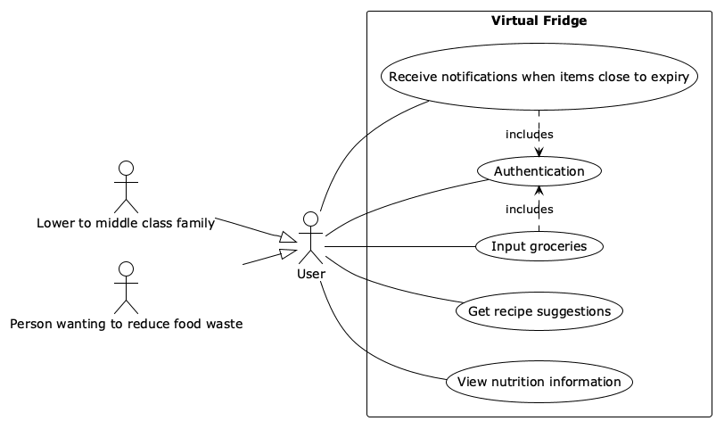
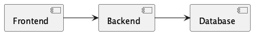

# Requirements and Design

## 1. Change History

| **Change Date**   | **Modified Sections** | **Rationale** |
| ----------------- | --------------------- | ------------- |
| _Nothing to show_ |

---

## 2. Project Description
Virtual Fridge is a smart companion for your kitchen, designed to help you stay organized, reduce food waste, and make healthier choices. By scanning barcodes, the app automatically tracks what products you've bought and keeps an up-to-date inventory of what's in your fridge. It sends timely notifications when items are nearing their expiration date, ensuring you use them before they go bad.

Beyond just tracking, Virtual Fridge helps you get the most out of your groceries. It suggests recipes based on the ingredients you already have, helping you save money while minimizing waste. You can also view detailed nutritional information for the foods in your fridge, making it easier to plan balanced meals. With Virtual Fridge, your kitchen becomes smarter, your meals more creative, and your lifestyle more sustainable.

---

## 3. Requirements Specification

### **3.1. List of Features**

### **3.2. Use Case Diagram**

### **3.3. Actors Description**
1. **[WRITE_NAME_HERE]**: ...
2. **[WRITE_NAME_HERE]**: ...

### **3.4. Use Case Description**
- Use cases for feature 1: [WRITE_FEATURE_1_NAME_HERE]
1. **[WRITE_NAME_HERE]**: ...
2. **[WRITE_NAME_HERE]**: ...
- Use cases for feature 2: [WRITE_FEATURE_2_NAME_HERE]
3. **[WRITE_NAME_HERE]**: ...
4. **[WRITE_NAME_HERE]**: ...
...

### **3.5. Formal Use Case Specifications (5 Most Major Use Cases)**

#### Use Case 1: [WRITE_USE_CASE_1_NAME_HERE]

**Description**: ...

**Primary actor(s)**: ... 
    
**Main success scenario**:
1. ...
2. ...

**Failure scenario(s)**:
- 1a. ...
    - 1a1. ...
    - 1a2. ...

- 1b. ...
    - 1b1. ...
    - 1b2. ...
                
- 2a. ...
    - 2a1. ...
    - 2a2. ...

...

#### Use Case 2: [WRITE_USE_CASE_2_NAME_HERE]
...

### **3.6. Screen Mock-ups**

### **3.7. Non-Functional Requirements**

1. **[WRITE_NAME_HERE]**
    - **Description**: ...
    - **Justification**: ...
2. ...

---

## 4. Designs Specification
### **4.1. Main Components**
1. **[WRITE_NAME_HERE]**
    - **Purpose**: ...
    - **Interfaces**: 
        1. ...
            - **Purpose**: ...
        2. ...
2. ...

### **4.2. Databases**
1. **[WRITE_NAME_HERE]**
    - **Purpose**: ...
2. ...

### **4.3. External Modules**
1. **[WRITE_NAME_HERE]** 
    - **Purpose**: ...
2. ...

### **4.4. Frameworks**
1. **[WRITE_NAME_HERE]**
    - **Purpose**: ...
    - **Reason**: ...
2. ...

### **4.5. Dependencies Diagram**

### **4.6. Use Case Sequence Diagram (5 Most Major Use Cases)**
1. [**Generate Recipe Suggestions**](#uc1)

2. ...

### **4.7. Design and Ways to Test Non-Functional Requirements**
1. [**[WRITE_NAME_HERE]**](#nfr1)
    - **Validation**: ...
2. ...
