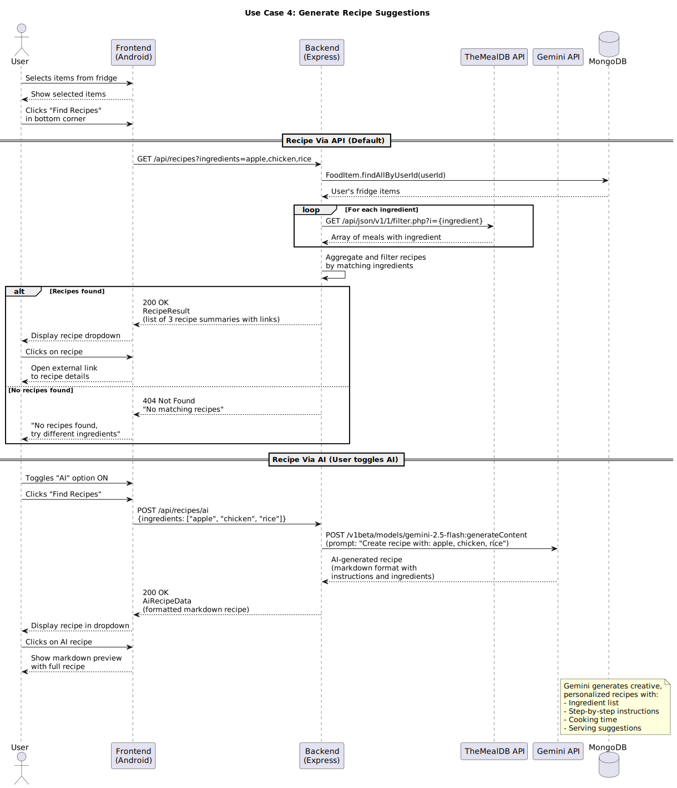

# Requirements and Design

## 1. Change History

| **Change Date**   | **Modified Sections** | **Rationale** |
| ----------------- | --------------------- | ------------- |
| 20/09/25          | Initial Commit

---

## 2. Project Description
Virtual Fridge is a smart companion for your kitchen, designed to help you stay organized, reduce food waste, and make healthier choices. By scanning barcodes, the app automatically tracks what products you've bought and keeps an up-to-date inventory of what's in your fridge. It sends timely notifications when items are nearing their expiration date, ensuring you use them before they go bad.

Beyond just tracking, Virtual Fridge helps you get the most out of your groceries. It suggests recipes based on the ingredients you already have, helping you save money while minimizing waste. You can also view detailed nutritional information for the foods in your fridge, making it easier to plan balanced meals. With Virtual Fridge, your kitchen becomes smarter, your meals more creative, and your lifestyle more sustainable.

---

## 3. Requirements Specification

### **3.1. List of Features**
1. **Authentication**: To access the app, users must complete a Google authentication process. A user must create an account with our app through their Google account. Users can sign out and delete their accounts, but cannot sign up multiple times with the same Google account

2. **Log Food**: The user can add their food to the app by scanning the aforementioned food. If the food has a barcode, the user can click a button on the home page to bring up a barcode scanner used to get the information from the food. Without a barcode, the user can take a picture of the item to log. If that logging fails, or gives an item that is incorrect, the user can select from a pre-made list. 

3. **View Fridge**: The user can see a home page listing all the scanned items. They are able to sort the food by different metrics, such as by expiration date, added date or by nutritional values. 

4. **Get Recipes**: The user can find recipes using one or more ingredients in their virtual fridge. After selecting the items on the home screen, the user can ask for recipes, in which they will receive a small list of recipe overviews which can be clicked on for more details surrounding more ingredients needed and cooking instructions. Generate recipes automatically with items in the fridge for the user to select if the user does not select any item.

5. **Get Nutrition**: The user can click on any item in their fridge and get the nutritional value for said item. There will be a new screen that appears showing nutritional facts such as calories, fat, carbs and protein.

6. **Expiry Notification**: Send notification to the user to alert them for expiring items. The user can configure the timing to get a notification when their food begins to expire. For example, the user could ask for 48 hours notice, giving them a notification 48 hours before any of the food in their fridge expires.

### **3.2. Use Case Diagram**

### **3.3. Actors Description**
1. **Users**: The users of the virtual fridge application are individuals and households who want to manage their food inventory more efficiently. They rely on the app to keep track of what items are currently in their fridge or pantry, monitor expiration dates, reduce food waste, and plan meals based on available ingredients. Users may include busy professionals, students, families, or anyone looking for convenience, organization, and cost savings in their daily food management.

2. **Barcode Scanner**: A module that scans a barcode and retrieves the ID of the associated product.

3. **The MealDB API**: An API that returns structured recipe data based on passed in parameters like ingredients.

4. **Open Food Facts API**: An API that returns nutritional data, images, product name, ingredients, and product ID based on passed in parameters.

5. **Google Authentication**: The authentication module provided by Google. This handles Users logging in or otherwise managing their profile using their Google account.

### **3.4. Use Case Description**
- Use cases for feature 1: Authentication
1. **Sign Up with Google**: Users create an account for the virtual fridge application by linking their Google account. Each Google account can only be registered once.
2. **Sign In with Google**: Users access the application by authenticating with their Google account credentials.
3. **Sign Out**: Users can securely log out of the application at any time.  
4. **Delete Account**: Users can permanently remove their account from the system, after which their associated data will be deleted. 
- Use cases for feature 2: Log Food
5. **Log Food via Barcode**: Users can scan the barcode of a food item using the in-app barcode scanner to automatically retrieve and log details such as name, brand, and nutritional information.  
6. **Log Food via Image**: Users can take a photo of a food item without a barcode, and the app will use image recognition to identify and log the item.  
7. **Log Food via Pre-Made List**: Users can manually select a food item from a curated list within the app to quickly add common items. 
- Use cases for feature 3: View Fridge
8. **View Food Inventory**: Users can access the home page to see a list of all logged food items currently in their virtual fridge.  
9. **Sort by Expiration Date**: Users can sort items to view which foods are closest to expiring, helping to reduce waste.  
10. **Sort by Added Date**: Users can sort items based on when they were logged into the system.  
- Use cases for feature 4: Get Recipes
11. **Generate Recipe Suggestions**: Users can request recipes, and the app provides a list of possible recipe overviews based on the selected ingredients, or, if the user does not select any items, a selection of ingredients that will expire soon.  
12. **View Recipe Details**: Users can click on a recipe overview to see more detailed information, including additional required ingredients, step-by-step cooking instructions, and preparation time.
- Use cases for feature 5: Get Nutrition
13. **View Nutritional Facts**: The app displays a new screen showing nutritional information such as calories, fat, carbohydrates, and protein.  

### **3.5. Formal Use Case Specifications (5 Most Major Use Cases)**

#### Use Case 1: Sign Up with Google

**Description**: Users create a new account for the virtual fridge application by linking their Google account. Each Google account can only be registered once.

**Primary actor(s)**: User 
    
**Main success scenario**:
1. User selects “Sign Up with Google.”  
2. System redirects user to Google authentication.  
3. User enters valid Google credentials.  
4. System verifies credentials and creates a new unique account.  
5. User is redirected to the app home page with their new account.  

**Failure scenario(s)**:
- 1a. User cancels Google authentication.  
  - 1a1. System returns to login screen without creating an account.  

- 2a. User enters invalid credentials.  
  - 2a1. System denies access and prompts retry.  

- 3a. Google account already linked to an existing user.  
  - 3a1. System displays error that duplicate registration is not allowed.  

#### Use Case 2: Log Food via Barcode

**Description**: Users add a food item to their virtual fridge by scanning its barcode with the in-app scanner.  

**Primary actor(s)**: User  

Main success scenario:
1. User selects “Add Food” and chooses the barcode option.  
2. User scans the barcode of the food item.  
3. System retrieves details (name, brand, nutritional info) from the database.
4. User clicks “Confirm”
4. System adds the food item to the user's fridge inventory.  

Failure scenario(s):
- 1a. Barcode is unreadable or damaged.  
  - 1a1. System displays error and prompts user to rescan or choose another method.  

- 2a. Food item not found in database.  
  - 2a1. System notifies user and offers manual entry.  

#### Use Case 3: View Fridge

**Description**: Users view their food inventory sorted in order of soonest to latest expiration.  

**Primary actor(s)**: User  

Main success scenario:
1. User navigates to the home page with their inventory list.  
2. User selects the “Sort by Expiration Date” option.  
3. System reorders food items in ascending order of expiration date.  
4. User sees items expiring soonest at the top of the list.
5. User holds and drags left on a food item to decrease food available
6. System updates the percentage value of food left
6. User holds and drags food item to 0%
7. System removes food item from fridge

Failure scenario(s):
- 1a. Inventory is empty.  
  - 1a1. System displays message: “No food logged. Add items to view inventory.”  

- 2a. Sorting function fails due to missing expiration data.  
  - 2a1. System displays error and defaults to unsorted list.

#### Use Case 4: Generate Recipe Suggestions

**Description**: Users request recipe suggestions using one or more ingredients from their virtual fridge.  

**Primary actor(s): User  

Main success scenarios:
For Recipe Via API
1. User selects recipes in the bottom left corner
2. User selects ingredients to add to recipe creation
3. User clicks “Confirm”
4. System calls recipe API and fetches 3 recipes containing specified ingredients
5. System opens screen showcasing dropdown of 3 recipes
6. User clicks on recipe and is redirected to the link to recipe

For Recipe Via AI
1. User selects recipes in the bottom left corner
2. User selects ingredients to add to recipe creation
3. User toggles on the “AI” toggle
4. User clicks “Confirm”
5. System prompts AI for a recipe with the given ingredients
6. System opens screen showcasing dropdown of 3 recipes
7. User clicks on recipe and is redirected to a markdown preview of the recipe

Failure scenario(s):

- 1a. No recipes match selected items.  
  - 1a1. The System notifies the User and suggests adding a different combination of ingredients
- 2a. The System cannot reach the API
  - 2a1. The System displays a message saying: “The API cannot be reached. Please try again later.”
- 3a. The System is not connected to the internet
  -3a1. The System displays a message saying: “We cannot connect to the Internet. Please try again later.”

#### Use Case 5: View Nutritional Facts

**Description**: Users view the nutritional information for a selected food item.  

**Primary actor(s)**: User

Main success scenario:
1. From the main menu, User clicks on a food item stored in their fridge
2. User clicks “Nutrition Info” on the food submenu
3. System fetches nutritional data (i.e. calories, fat, carbs, and protein, etc.) for the item
4. System displays nutritional information (i.e. calories, fat, carbs, and protein, etc.) within the item's submenu

Failure scenario(s):
- 1a. Selected food item does not have nutritional data available.  
  - 1a1. System informs user and offers manual entry option.  

- 2a. Database or network error occurs.  
  - 2a1. System displays error and prompts user to retry.

#### Use Case 6: Expiry Notification

**Description**: The system notifies the user when a stored food item is nearing its expiry date. Users can configure how many hours or days before expiry they would like to be notified.

**Primary actor(s)**: Users: The users of the virtual fridge application are individuals and households who want to manage their food inventory more efficiently. They rely on the app to keep track of what items are currently in their fridge or pantry, monitor expiration dates, reduce food waste, and plan meals based on available ingredients. Users may include busy professionals, students, families, or anyone looking for convenience, organization, and cost savings in their daily food management.

Main success scenario:
1. From the settings menu, User selects “Expiry Notifications.”
2. User specifies the preferred notification window (e.g., 48 hours before expiry).
3. System saves the notification preference.
4. When a food item in the fridge is approaching its expiry date within the configured window, the system generates a notification.
5. User receives a notification alerting them about the expiring item(s).

Failure scenario(s):
- 4a. System fails to process expiry dates due to database or network error.
  - 4a1. System logs the error and retries later.
  - 4a2. If the error persists, system displays a notification informing the user that expiry alerts are temporarily unavailable.

#### General Failure Scenario:
- 1a. The backend server is down.
  - 1a1. Notifies the user that the backend server is down and their request cannot be processed.

### **3.6. Screen Mock-ups**

### **3.7. Non-Functional Requirements**

1. **Barcode Scanning Response Time**
  - **Description**: The barcode scanning feature must process and return results within 5 seconds.
  - **Justification**: According to a study on mobile 1D barcode scanners, "feedback and performance of a read must not exceed five seconds." This guideline ensures that users receive timely feedback, enhancing the overall user experience. [cocoa.ethz.ch](https://cocoa.ethz.ch/downloads/2014/06/None_AUTOIDLAB-WP-SWNET-029.pdf?utm_source=chatgpt.com)

2. **Image Recognition Accuracy**
  - **Description**: The image recognition feature should achieve at least a 95% accuracy rate in identifying food items.
  - **Justification**: Users will be displeased if the OCR consistently makes mistakes when logging produce. The standard acceptance is around 95-97%. A well-implemented solution typically delivers 95-97% accuracy” [softservebs](http://softservebs.com/en/resources/ai-product-recognition/)

3. **Mobile App Load Time**
**Description**: The application should load and become interactive within 2.5 seconds of launch.
**Justification**: Studies indicate that a large portion of visitors will leave if an application takes too long to load. “Statistics indicate that 40% of visitors will leave a website if it takes longer than 3 seconds to load.” [BrowserStack](https://www.browserstack.com/guide/how-fast-should-a-website-load)

---

## 4. Designs Specification
### **4.1. Main Components**
1. **Authentication Component**
   - **Purpose**: Manages all user account operations including sign-up, sign-in, sign-out, and account deletion using Google authentication.  
   - **Interfaces**:  
     1. **Google Auth API**  
        - **Purpose**: Verify user identity and credentials.  
     2. **User Account Manager**  
        - **Purpose**: Create, update, and delete user accounts in the system database.  

2. **Food Logging Component**
   - **Purpose**: Allows users to add food items to their virtual fridge via barcode scan, image recognition, or manual list selection.  
   - **Interfaces**:  
     1. **Barcode Scanner Interface**  
        - **Purpose**: Scan and decode food product barcodes.  
     2. **Image Recognition Module**  
        - **Purpose**: Process pictures of food items and identify them.  
     3. **Pre-Made List Selector**  
        - **Purpose**: Provide users with a quick list of common foods to log manually.  

3. **Inventory Management Component**
   - **Purpose**: Displays and manages the list of all food items in the virtual fridge, including sorting by expiration date, added date, or nutritional values.  
   - **Interfaces**:  
     1. **Inventory Display UI**  
        - **Purpose**: Show all logged food items to the user.  
     2. **Sorting Engine**  
        - **Purpose**: Apply user-selected sorting criteria (expiration, date added, nutrition).  

4. **Recipe Suggestion Component**
   - **Purpose**: Generates recipe suggestions based on selected ingredients and provides detailed recipe instructions.  
   - **Interfaces**:  
     1. **Ingredient Selector**  
        - **Purpose**: Allow users to choose items from their inventory.  
     2. **Recipe Engine**  
        - **Purpose**: Match selected ingredients with recipes and return suggestions.  
     3. **Recipe Details UI**  
        - **Purpose**: Display additional ingredients, instructions, and cooking steps.  

5. **Nutrition Information Component**
   - **Purpose**: Provides detailed nutritional information for food items in the fridge.  
   - **Interfaces**:  
     1. **Nutrition Database Connector**  
        - **Purpose**: Retrieve nutritional facts (calories, carbs, protein, fat).  
     2. **Nutrition Display UI**  
        - **Purpose**: Show nutritional information and allow comparisons between items.  

6. **Expiry Notification Component**
  - **Purpose**: Monitors expiry dates of logged food items and sends timely notifications to users based on their configured preferences.
  - **Interfaces**:
    1. **Cron**
      - **Purpose**: Schedule and trigger notifications when items approach their expiry within the user-defined time window.
    2. **Food Database Interface**
      - **Purpose**: Retrieve expiry dates and user-configured notification settings for stored food items.
    3. **User Notification Service**
      - **Purpose**: Deliver expiry alerts to the user via mobile push notifications or in-app messages.

### **4.2. Databases**
1. **User Collection**
   - **Purpose**: Stores user profile and preference information, enabling personalized experiences within the app.  
   - **Key Fields**:  
     - `user_id`: Unique identifier for each user  
     - `name`: User's full name  
     - `email`: User's email address (linked to Google account)  
     - `dietary_preference`: User-defined dietary restrictions or preferences (e.g., vegetarian, low-carb)  
     - `expiration_date_preference`: Customizable rules for how users prefer to track expiry dates  

2. **Fridge Collection**
   - **Purpose**: Stores the inventory of food items for each user's virtual fridge, including details required for tracking, sorting, and recipe generation.  
   - **Key Fields**:  
     - `fridge_id`: Unique identifier for each fridge (linked to `user_id`)  
     - `food`: Array of food items containing:  
       - `type`: Name/type of food item (e.g., apple, milk)  
       - `barcode_id`: Associated barcode identifier if available  
       - `expiration_date`: Computed or user-specified expiry date  
       - `nutritional_info`: Nested object with calories, protein, fat, carbs, etc.  

3. **Food Expiration Reference Collection**
   - **Purpose**: Provides baseline shelf-life data for different food types to help calculate default expiration dates when new items are logged.  
   - **Key Fields**:  
     - `food_type`: Name/type of food item (e.g., apple, bread, chicken)  
     - `shelf_life_days`: Average number of days the food lasts (used to compute expiration date when logged) 

### **4.3. External Modules**
1. **Google Authenticator**
   - **Purpose**: Provides secure authentication and account management through Google sign-in, ensuring users have a single, unique account tied to their Google credentials.  

2. **Barcode Scanner**
   - **Purpose**: Scans and decodes product barcodes, enabling fast and accurate food item logging by retrieving product identifiers.  

3. **Open Food Facts API**
   - **Purpose**: Supplies detailed food product information, including nutritional values, ingredients, and barcodes, to enrich the food logging process.  

4. **DeepSeek**
   - **Purpose**: Uses AI to generate recipe ideas based on available ingredients, providing creative and personalized cooking suggestions.  

5. **Google Cloud Notifications**
   - **Purpose**: Sends push notifications and reminders (e.g., when items are close to expiration) to help users reduce food waste.  

6. **The Meal DB API**
   - **Purpose**: Provides structured recipe data (overview, ingredients, instructions) that the app can display to users for meal preparation.  

7. **OCR**
   - **Purpose**: Processes images of food items without barcodes, extracting text or features to help identify and log them accurately.  

### **4.4. Frameworks**
1. **Express.js**
  - **Purpose**: Provides a lightweight and flexible web application framework for building the backend server. It handles routing, middleware, and communication between the client, server, and database.  
  - **Reason**: Express.js is widely adopted, simple to set up, and highly extensible. Its large ecosystem of middleware makes it ideal for quickly developing APIs to connect the virtual fridge application's frontend with MongoDB and external modules. 

### **4.5. Dependencies Diagram**

### **4.6. Use Case Sequence Diagram (5 Most Major Use Cases)**
1. [**Sign up with Google**](#uc1)

2. [**Log Food via Barcode**](#uc2)

3. [**View Fridge**](#uc3)

4. [**Generate Recipe Suggestions**](#uc4)

5. [**View Nutritional Facts**](#uc5)

### **4.7. Design and Ways to Test Non-Functional Requirements**
1. [**Barcode Scanning Response Time**](#nfr1)
**Idea**: Measure the time from when a user initiates the scan to when the food data is displayed.
**Method**: Use a stopwatch or logging timestamps in the app during multiple tests with different devices and lighting conditions.
**Goal**: Ensure the average scan time is ≤ 5 seconds.

2. [**Image Recognition Accuracy**](#nfr2)
**Idea**: Prepare a test set of food images (with and without barcodes).
**Method**: Log the number of correctly identified items versus total items.
**Goal**: Confirm accuracy is ≥ 95%, accounting for lighting, angle, and occlusion variations.

3. [**Mobile App Load Time**](#nfr3)
**Idea**: Track the time from app launch to full interactivity on Android devices.
**Method**: Perform multiple launches on different devices and network conditions.
**Goal**: Confirm that the app consistently loads in ≤ 2.5 seconds.
