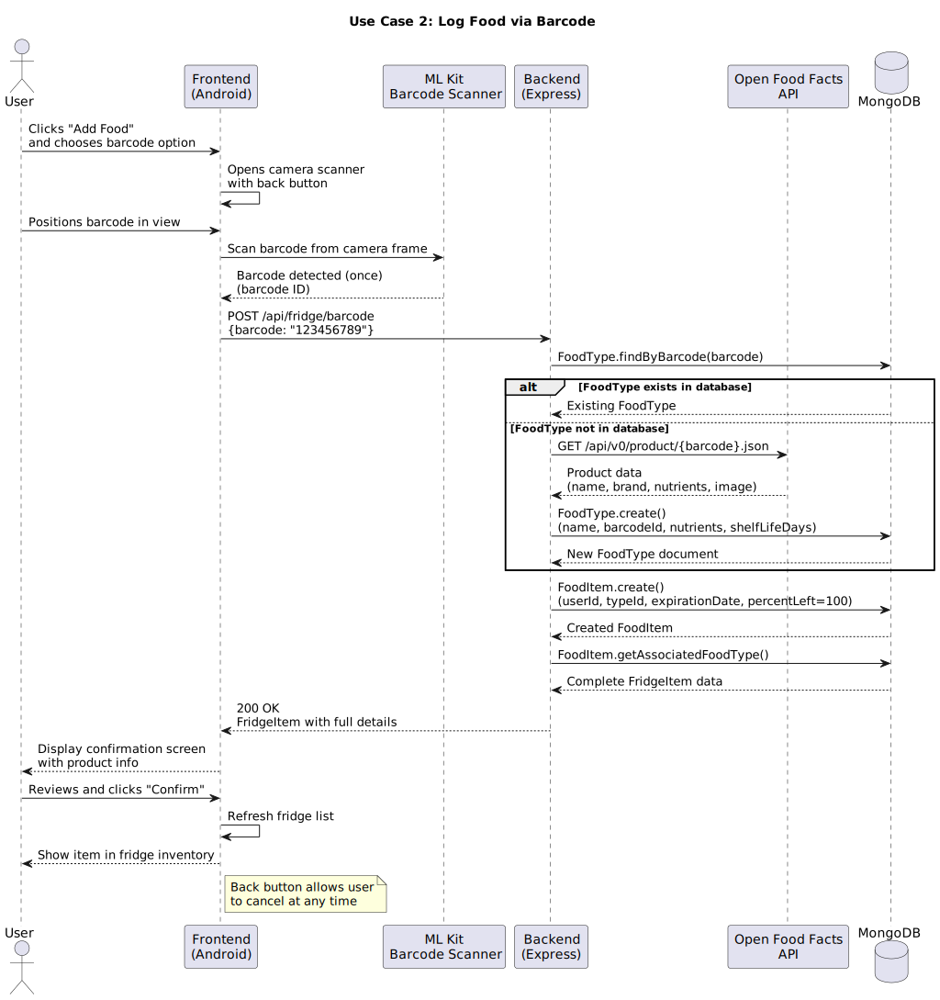
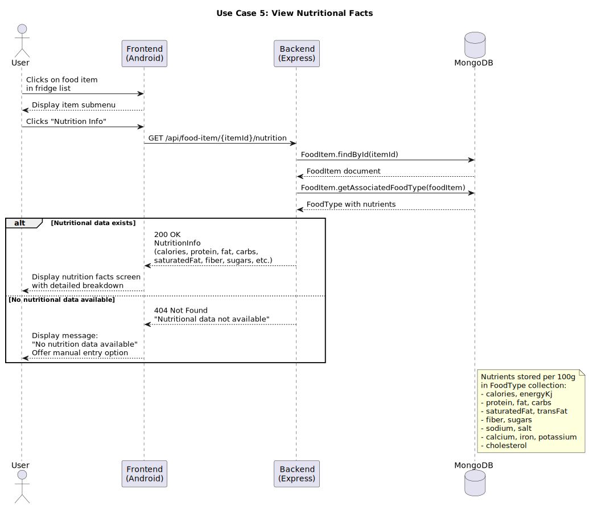

# Requirements and Design

## 1. Change History

| **Change Date**   | **Modified Sections** | **Rationale** |
| ----------------- | --------------------- | ------------- |
| 20/09/25          | All                   | Initial Commit |
| 27/09/25          | 3.3 Actors Description | Added Gemini API which was missing |
| 27/09/25          | 3.5 Formal Use Case Specifications | Fix failure scenario numbering, do not use authentication as a major use case, make naming more consistent|
| 27/09/25          | 4.4 Frameworks | Filled this in more completely; before it just had express|
|27/09/25          | 4.2 Databases|Added more details with the actual fields in the database|

---

## 2. Project Description
Virtual Fridge is a smart companion for your kitchen, designed to help you stay organized, reduce food waste, and make healthier choices. By scanning barcodes, the app automatically tracks what products you've bought and keeps an up-to-date inventory of what's in your fridge. It sends timely notifications when items are nearing their expiration date, ensuring you use them before they go bad.

Beyond just tracking, Virtual Fridge helps you get the most out of your groceries. It suggests recipes based on the ingredients you already have, helping you save money while minimizing waste. You can also view detailed nutritional information for the foods in your fridge, making it easier to plan balanced meals. With Virtual Fridge, your kitchen becomes smarter, your meals more creative, and your lifestyle more sustainable.

---

## 3. Requirements Specification

### **3.1. List of Features**
1. **Authentication**: To access the app, users must complete a Google authentication process. A user must create an account with our app through their Google account. Users can sign out and delete their accounts, but cannot sign up multiple times with the same Google account

2. **Log Food**: The user can add their food to the app by scanning the aforementioned food. If the food has a barcode, the user can click a button on the home page to bring up a barcode scanner used to get the information from the food. Without a barcode, the user can take a picture of the item to log. If that logging fails, or gives an item that is incorrect, the user can select from a pre-made list. 

3. **View Fridge**: The user can see a home page listing all the scanned items. They are able to sort the food by different metrics, such as by expiration date, added date or by nutritional values. 

4. **Get Recipes**: The user can find recipes using one or more ingredients in their virtual fridge. After selecting the items on the home screen, the user can ask for recipes, in which they will receive a small list of recipe overviews which can be clicked on for more details surrounding more ingredients needed and cooking instructions. Generate recipes automatically with items in the fridge for the user to select if the user does not select any item.

5. **Get Nutrition**: The user can click on any item in their fridge and get the nutritional value for said item. There will be a new screen that appears showing nutritional facts such as calories, fat, carbs and protein.

6. **Expiry Notification**: Send notification to the user to alert them for expiring items. The user can configure the timing to get a notification when their food begins to expire. For example, the user could ask for 48 hours notice, giving them a notification 48 hours before any of the food in their fridge expires.

### **3.2. Use Case Diagram**


### **3.3. Actors Description**
1. **Users**: The users of the virtual fridge application are individuals and households who want to manage their food inventory more efficiently. They rely on the app to keep track of what items are currently in their fridge or pantry, monitor expiration dates, reduce food waste, and plan meals based on available ingredients. Users may include busy professionals, students, families, or anyone looking for convenience, organization, and cost savings in their daily food management.

2. **Barcode Scanner**: A module that scans a barcode and retrieves the ID of the associated product.

3. **Gemini API**: Google's AI service. It that processes images of food items to identify and classify them. When given an image, Gemini analyzes the visual content and determines what food item is present, if any. It can also be used to generate creative and personalized recipe suggestions based on available ingredients.

4. **The MealDB API**: An API that returns structured recipe data based on passed in parameters like ingredients.

5. **Open Food Facts API**: An API that returns nutritional data, images, product name, ingredients, and product ID based on passed in parameters.

6. **Google Authentication**: The authentication module provided by Google. This handles Users logging in or otherwise managing their profile using their Google account.

### **3.4. Use Case Description**
- Use cases for feature 1: Authentication
1. **Sign Up with Google**: Users create an account for the virtual fridge application by linking their Google account. Each Google account can only be registered once.
2. **Sign In with Google**: Users access the application by authenticating with their Google account credentials.
3. **Sign Out**: Users can securely log out of the application at any time.
4. **Delete Account**: Users can permanently remove their account from the system, after which their associated data will be deleted. 
- Use cases for feature 2: Log Food
5. **Log Food via Barcode**: Users can scan the barcode of a food item using the in-app barcode scanner to automatically retrieve and log details such as name, brand, and nutritional information.
6. **Log Food via Image**: Users can take a photo of a food item without a barcode, and the app will use Gemini API to identify and log the item.
7. **Log Food via Pre-Made List**: Users can manually select a food item from a curated list within the app to quickly add common items. 
- Use cases for feature 3: View Fridge
8. **View Fridge**: Users can access the home page to see a list of all logged food items currently in their virtual fridge.  
9. **Sort by Expiration Date**: Users can sort items to view which foods are closest to expiring, helping to reduce waste.  
10. **Sort by Added Date**: Users can sort items based on when they were logged into the system.  
- Use cases for feature 4: Get Recipes
11. **Find Recipe Suggestions**: Users can request recipes, and the app provides a list of possible recipe overviews based on the selected ingredients.
12. **Generate Recipe Suggestions with AI**: Users can request recipes, and the app provides an AI generated recipe that includes the selected ingredients.
12. **View Recipe Details**: Users can click on a recipe overview to see more detailed information, including additional required ingredients, step-by-step cooking instructions, and preparation time.
- Use cases for feature 5: Get Nutrition
13. **View Nutritional Facts**: The app displays a new screen showing nutritional information such as calories, fat, carbohydrates, and protein.  

### **3.5. Formal Use Case Specifications (5 Most Major Use Cases)**
<a name="uc1"></a>

#### Use Case 1: Log Food via Image (UC-LOG-2)

**Description**: Users add a produce item (fruit or vegetable) to their virtual fridge by uploading a photo that is analyzed by Gemini AI.

**Primary actor**: User

**Secondary actors**: Gemini API

**Preconditions**:
- User is authenticated with valid JWT token
- User has captured an image file on their device

**Main success scenario**:
1. User uploads an image file through the frontend.
2. Frontend sends POST request to `/api/media/vision` with image (multipart/form-data) and JWT token.
3. Backend authenticates JWT and extracts userId.
4. Backend saves uploaded image to server storage.
5. Backend reads image file and encodes to base64.
6. Backend sends image to Gemini API requesting produce identification (fruit or vegetable only).
7. Gemini API analyzes image and returns JSON with `isProduce: true`, produce name (e.g., "apple"), and optional nutrients.
8. Backend converts produce name to title case and searches database for matching FoodType.
9. If FoodType not found, backend creates new FoodType with name and default 14-day shelf life.
10. If Gemini returned nutrients, backend updates FoodType with nutrient data.
11. Backend calculates expiration date as current date + 14 days.
12. Backend creates new FoodItem with userId, typeId, expirationDate, and percentLeft=100.
13. Backend returns 200 OK with FridgeItem (combined foodItem + foodType).

**Postconditions**:
- New FoodItem exists in database linked to user
- Image file stored in server storage
- FoodType exists with produce name

**Failure scenarios**:
- **2a. No file uploaded**
  - 2a1. At step 2, request contains no file.
  - 2a2. Backend returns 400 with message "No file uploaded".
  - 2a3. Use case ends unsuccessfully.

- **3a. JWT token invalid**
  - 3a1. At step 3, auth middleware cannot verify token.
  - 3a2. Backend returns 401 Unauthorized.
  - 3a3. Use case ends unsuccessfully.

- **6a. Gemini API request fails**
  - 6a1. At step 6, network request to Gemini times out or returns 500+ error.
  - 6a2. Exception thrown and caught by controller.
  - 6a3. Backend returns 500 with message "Failed to process vision scan".
  - 6a4. Use case ends unsuccessfully.

- **7a. Image does not contain produce**
  - 7a1. At step 7, Gemini returns `isProduce: false` or `name` field is missing/null.
  - 7a2. Backend returns 400 with message "Item detected must be a fruit or vegetable".
  - 7a3. Use case ends unsuccessfully.

- **7b. Gemini returns invalid response**
  - 7b1. At step 7, Gemini response cannot be parsed or validation fails.
  - 7b2. Backend falls back to `{isProduce: false}`.
  - 7b3. Continues to failure scenario 7a.

- **9a. Database error creating FoodType**
  - 9a1. At step 9, FoodType creation fails or returns null.
  - 9a2. Backend returns 500 with message "Failed to find or create foodType".
  - 9a3. Use case ends unsuccessfully.

- **12a. Database error creating FoodItem**
  - 12a1. At step 12, FoodItem creation throws exception.
  - 12a2. Backend catches error and returns 500 with message "Failed to process vision scan".
  - 12a3. FoodType may exist without FoodItem (orphaned data).
  - 12a4. Use case ends unsuccessfully.

<a name="uc2"></a>

#### Use Case 2: Log Food via Barcode (UC-LOG-1)

**Description**: Users add a packaged food item to their virtual fridge by submitting a scanned barcode that is looked up in Open Food Facts API.

**Primary actor**: User

**Secondary actors**: Open Food Facts API

**Preconditions**:
- User is authenticated with valid JWT token
- User has scanned a barcode (frontend responsibility)

**Main success scenario**:
1. User scans barcode using frontend camera and ML Kit (barcode detection happens on device).
2. Frontend sends POST request to `/api/fridge/barcode` with barcode string and JWT token.
3. Backend authenticates JWT and extracts userId.
4. Backend searches database for existing FoodType with matching barcodeId.
5. If FoodType not found, backend queries Open Food Facts API at `https://world.openfoodfacts.org/api/v2/product/{barcode}.json`.
6. Open Food Facts API returns product data including name, brand, nutrients, allergens, and optional expiration date.
7. Backend extracts nutritional data from product.nutriments (calories, protein, fat, carbs, vitamins, etc.).
8. Backend calculates shelf life days from product expiration_date if available.
9. Backend creates new FoodType with name, brand, barcodeId, nutrients, shelfLifeDays, image, and allergens.
10. Backend calculates expiration date as current date + shelfLifeDays (if available).
11. Backend creates new FoodItem with userId, typeId, expirationDate, and percentLeft=100.
12. Backend returns 200 OK with FridgeItem (combined foodItem + foodType).

**Postconditions**:
- New FoodItem exists in database linked to user
- FoodType exists with barcode and product data

**Failure scenarios**:
- **2a. Request missing barcode**
  - 2a1. At step 2, request body does not contain barcode field.
  - 2a2. Validation middleware returns 400 Bad Request.
  - 2a3. Use case ends unsuccessfully.

- **3a. JWT token invalid**
  - 3a1. At step 3, auth middleware cannot verify token.
  - 3a2. Backend returns 500 with message "Internal server error" (logged as auth error).
  - 3a3. Use case ends unsuccessfully.

- **6a. Product not found in Open Food Facts**
  - 6a1. At step 6, API returns response where `data.product` is null/undefined.
  - 6a2. Backend returns 404 with message "Product not found in OpenFoodFacts".
  - 6a3. Use case ends unsuccessfully.

- **6b. Open Food Facts API request fails**
  - 6b1. At step 6, axios request fails (network error, timeout, 500+ response).
  - 6b2. Exception thrown and caught.
  - 6b3. Backend returns 500 with message "Internal server error".
  - 6b4. Use case ends unsuccessfully.

- **9a. Database error creating FoodType**
  - 9a1. At step 9, FoodType creation fails or returns null.
  - 9a2. Backend returns 500 with message "Failed to find or create foodType".
  - 9a3. Use case ends unsuccessfully.

- **11a. Database error creating FoodItem**
  - 11a1. At step 11, FoodItem creation throws exception.
  - 11a2. Backend catches error and returns 500 with message "Internal server error".
  - 11a3. FoodType may exist without FoodItem (orphaned data).
  - 11a4. Use case ends unsuccessfully.

<a name="uc3"></a>

#### Use Case 3: View Fridge Contents (UC-FRIDGE-1)

**Description**: Users retrieve and view all food items currently in their virtual fridge.

**Primary actor**: User

**Secondary actors**: None

**Preconditions**:
- User is authenticated with valid JWT token

**Main success scenario**:
1. User navigates to fridge/home page in frontend.
2. Frontend sends GET request to `/api/fridge` with JWT token.
3. Backend authenticates JWT and extracts userId.
4. Backend queries database for all FoodItems where userId matches.
5. For each FoodItem, backend retrieves associated FoodType by calling `getAssociatedFoodType()`.
6. Backend builds array of FridgeItems (each containing foodItem + foodType data).
7. Backend returns 200 OK with array of FridgeItems in response.data.fridgeItems.
8. Frontend renders list of food items with name, image, expiration date, and percentLeft.

**Postconditions**:
- User sees current fridge inventory
- No data is modified

**Failure scenarios**:
- **2a. Frontend has no network connection**
  - 2a1. At step 2, network request fails before reaching backend.
  - 2a2. Frontend displays error (handled by frontend, not backend).
  - 2a3. Use case ends unsuccessfully.

- **3a. JWT token invalid**
  - 3a1. At step 3, auth middleware cannot verify token.
  - 3a2. Backend returns 500 with message "Internal server error" (logged as auth error).
  - 3a3. Use case ends unsuccessfully.

- **4a. User has empty fridge**
  - 4a1. At step 4, database query returns empty array.
  - 4a2. Backend returns 200 OK with empty fridgeItems array.
  - 4a3. Frontend displays empty state message (frontend responsibility).
  - 4a4. Use case ends successfully (valid state).

- **4b. Database query fails**
  - 4b1. At step 4, database operation throws exception.
  - 4b2. Backend catches error and returns 500 with message "Failed to get fridge items".
  - 4b3. Use case ends unsuccessfully.

- **5a. FoodType not found for FoodItem**
  - 5a1. At step 5, `getAssociatedFoodType()` cannot find FoodType (data inconsistency).
  - 5a2. Method may throw exception or return null.
  - 5a3. Backend error handling returns 500 with message "Failed to get fridge items".
  - 5a4. Use case ends unsuccessfully.

<a name="uc4"></a>

#### Use Case 4: Generate AI Recipe with Gemini (UC-RECIPE-2)

**Description**: Users generate a custom AI-created recipe using ingredient names from their fridge.

**Primary actor**: User

**Secondary actors**: Gemini API

**Preconditions**:
- User is authenticated with valid JWT token
- User has selected one or more ingredients (or uses default ingredients)

**Main success scenario**:
1. User selects ingredients from fridge in frontend and clicks "Generate AI Recipe".
2. Frontend sends POST request to `/api/recipes/ai` with ingredients array and JWT token.
3. Backend authenticates JWT (via middleware).
4. Backend extracts ingredients from request body, or uses default ingredients if array is empty.
5. Backend formats ingredients into TOML payload with ingredient names, IDs, and display names.
6. Backend constructs prompt instructing Gemini to create one recipe using provided ingredients in Markdown format.
7. Backend sends POST request to Gemini API at `{GEMINI_API_HOST}/{GEMINI_MODEL}:generateContent` with prompt.
8. Gemini API processes request and returns generated recipe text in Markdown format.
9. Backend extracts recipe text from Gemini response.candidates[0].content.parts.
10. Backend returns 200 OK with recipe data including ingredients, prompt, recipe text, and model version.
11. Frontend displays the generated recipe in Markdown viewer.

**Postconditions**:
- User has received a custom recipe (not saved to database)
- No data persists server-side

**Failure scenarios**:
- **2a. Request body missing or invalid**
  - 2a1. At step 2, validation middleware detects invalid body structure.
  - 2a2. Backend returns 400 Bad Request.
  - 2a3. Use case ends unsuccessfully.

- **3a. JWT token invalid**
  - 3a1. At step 3, auth middleware cannot verify token.
  - 3a2. Backend proceeds but may fail later (auth check is middleware).
  - 3a3. Use case may end unsuccessfully.

- **4a. GEMINI_API_KEY not set**
  - 4a1. At step 4, if environment variable GEMINI_API_KEY is missing.
  - 4a2. AiRecipeService throws error "GEMINI_API_KEY is not set".
  - 4a3. Backend catches error and returns 502 with message "Failed to generate recipe with Gemini."
  - 4a4. Use case ends unsuccessfully.

- **7a. Gemini API request fails**
  - 7a1. At step 7, axios request to Gemini fails (network error, timeout, 500+ response).
  - 7a2. Exception thrown.
  - 7a3. Backend catches error and returns 502 with message "Failed to generate recipe with Gemini."
  - 7a4. Use case ends unsuccessfully.

- **9a. Gemini returns empty or invalid response**
  - 9a1. At step 9, response.candidates[0] is missing or parts array is empty.
  - 9a2. extractRecipeText() returns null.
  - 9a3. Backend throws error "Gemini returned an empty response."
  - 9a4. Backend catches and returns 502 with message "Failed to generate recipe with Gemini."
  - 9a5. Use case ends unsuccessfully.

<a name="uc5"></a>

#### Use Case 5: View Food Item Details (UC-FRIDGE-4)

**Description**: Users retrieve detailed information about a specific food item in their fridge, including nutritional facts from the associated FoodType.

**Primary actor**: User

**Secondary actors**: None

**Preconditions**:
- User is authenticated with valid JWT token
- User has at least one food item in their fridge

**Main success scenario**:
1. User clicks on a food item in the fridge list in frontend.
2. Frontend sends GET request to `/api/food-item/{itemId}` with JWT token.
3. Backend authenticates JWT (via middleware).
4. Backend queries database for FoodItem by _id.
5. Backend returns FoodItem with userId, typeId, expirationDate, and percentLeft.
6. Frontend makes separate request to retrieve associated FoodType (or caches it from initial fridge load).
7. FoodType contains nutrients object with calories, protein, fat, carbs, vitamins, minerals, etc.
8. Frontend displays food item details including name, expiration, quantity, and nutritional information.

**Postconditions**:
- User has viewed food item details
- No data is modified

**Failure scenarios**:
- **3a. JWT token invalid**
  - 3a1. At step 3, auth middleware cannot verify token.
  - 3a2. Backend returns 401 Unauthorized or 500 (depending on middleware implementation).
  - 3a3. Use case ends unsuccessfully.

- **4a. FoodItem not found**
  - 4a1. At step 4, database query returns null (item doesn't exist or wrong itemId).
  - 4a2. Backend returns 404 with message "FoodItem with ID {_id} not found."
  - 4a3. Use case ends unsuccessfully.

- **4b. Database query fails**
  - 4b1. At step 4, database operation throws exception.
  - 4b2. Backend catches error and returns 500 with message "Failed to get foodItem".
  - 4b3. Use case ends unsuccessfully.

- **7a. FoodType has no nutrients**
  - 7a1. At step 7, associated FoodType.nutrients is null, undefined, or empty object.
  - 7a2. Backend still returns 200 OK with FoodItem (doesn't validate nutrient existence).
  - 7a3. Frontend displays food item but shows "Nutritional information not available" for missing fields.
  - 7a4. Use case ends successfully but with incomplete data.

**Note**: There is no dedicated `/api/food-item/{itemId}/nutrition` endpoint. Nutritional data must be retrieved through the general FoodItem endpoint and then accessing the associated FoodType's nutrients field.

### **3.6. Screen Mock-ups**


### **3.7. Non-Functional Requirements**

<a name="nfr1"></a>
1. **Barcode Scanning Response Time**
  - **Description**: The barcode scanning feature must process and return results within 5 seconds.
  - **Justification**: According to a study on mobile 1D barcode scanners, "feedback and performance of a read must not exceed five seconds." This guideline ensures that users receive timely feedback, enhancing the overall user experience. [cocoa.ethz.ch](https://cocoa.ethz.ch/downloads/2014/06/None_AUTOIDLAB-WP-SWNET-029.pdf?utm_source=chatgpt.com)

<a name="nfr2"></a>
2. **Image Recognition Accuracy**
  - **Description**: The Gemini API-based image recognition feature should achieve at least a 95% accuracy rate in identifying food items.
  - **Justification**: Users will be displeased if the AI consistently makes mistakes when logging produce. The standard acceptance is around 95-97%. A well-implemented solution typically delivers 95-97% accuracy" [softservebs](http://softservebs.com/en/resources/ai-product-recognition/)

<a name="nfr3"></a>
3. **Mobile App Load Time**
  - **Description**: The application should load and become interactive within 3 seconds of launch.
  - **Justification**: Studies indicate that a large portion of visitors will leave if an application takes too long to load. “Statistics indicate that 40% of visitors will leave a website if it takes longer than 3 seconds to load.” [BrowserStack](https://www.browserstack.com/guide/how-fast-should-a-website-load)

---

## 4. Designs Specification
### **4.1. Main Components**

1. **Authentication Component**
   - **Purpose**: Manages all user account operations including sign-up, sign-in, sign-out, and account deletion using Google authentication.
   - **Interfaces**:

     1. **signUpWithGoogle** (Frontend → Backend)
        - **REST Route**: `POST /api/auth/signup`
        - **Signature**: `AuthResult signUpWithGoogle(String idToken)`
        - **Parameters**: `idToken` - Google OAuth ID token from client
        - **Returns**: `AuthResult` - Contains JWT access token and user profile data
        - **Purpose**: Creates a new user account by verifying the Google ID token and storing user information in the database. Returns authentication credentials for subsequent requests.

     2. **signInWithGoogle** (Frontend → Backend)
        - **REST Route**: `POST /api/auth/signin`
        - **Signature**: `AuthResult signInWithGoogle(String idToken)`
        - **Parameters**: `idToken` - Google OAuth ID token from client
        - **Returns**: `AuthResult` - Contains JWT access token and user profile data
        - **Purpose**: Authenticates existing users by verifying their Google credentials and returning a session token for API access.

     3. **verifyGoogleToken** (Backend → Google Auth API)
        - **External API**: Google OAuth2 API
        - **Signature**: `GoogleUserInfo verifyGoogleToken(String idToken, String audience)`
        - **Parameters**: `idToken` - Token to verify, `audience` - Expected client ID
        - **Returns**: `GoogleUserInfo` - Contains googleId, email, name, profilePicture
        - **Purpose**: Validates the authenticity of Google ID tokens by communicating with Google's authentication servers.

     4. **createUser** (Backend - Internal)
        - **Signature**: `User createUser(GoogleUserInfo userInfo)`
        - **Parameters**: `userInfo` - Validated user information from Google
        - **Returns**: `User` - Created user document with MongoDB ID
        - **Purpose**: Stores new user profile in the database with default preferences and settings.

     5. **deleteAccount** (Frontend → Backend)
        - **REST Route**: `DELETE /api/user`
        - **Signature**: `void deleteAccount(String userId)`
        - **Parameters**: `userId` - Authenticated user's ID from JWT token
        - **Returns**: `void`
        - **Purpose**: Permanently removes user account and all associated data from the system.

2. **Food Logging Component**
   - **Purpose**: Allows users to add food items to their virtual fridge via barcode scan, image recognition, or manual list selection.
   - **Interfaces**:

     1. **logFoodItemByBarcode** (Frontend → Backend)
        - **REST Route**: `POST /api/fridge/barcode`
        - **Signature**: `FridgeItem logFoodItemByBarcode(String barcode, String userId)`
        - **Parameters**: `barcode` - Scanned barcode number, `userId` - Authenticated user ID
        - **Returns**: `FridgeItem` - Created food item with details and nutritional info
        - **Purpose**: Processes barcode scan by querying Open Food Facts API and creating a food item in the user's fridge.

     2. **queryBarcodeData** (Backend → Open Food Facts API)
        - **External API**: `GET https://world.openfoodfacts.org/api/v0/product/{barcode}.json`
        - **Signature**: `ProductData queryBarcodeData(String barcode)`
        - **Parameters**: `barcode` - Product barcode identifier
        - **Returns**: `ProductData` - Product name, brand, nutrients, image, expiration info
        - **Purpose**: Retrieves comprehensive product information from the Open Food Facts database using the barcode.

     3. **identifyFoodFromImage** (Frontend → Backend)
        - **REST Route**: `POST /api/fridge/image`
        - **Signature**: `FridgeItem identifyFoodFromImage(Image image, String userId)`
        - **Parameters**: `image` - Captured food image (multipart/form-data), `userId` - Authenticated user ID
        - **Returns**: `FridgeItem` - Identified food item with details
        - **Purpose**: Sends food image to Gemini API for identification and creates a fridge item with the recognized food.

     4. **analyzeImageWithGemini** (Backend → Gemini API)
        - **External API**: `POST https://generativelanguage.googleapis.com/v1beta/models/gemini-2.5-flash:generateContent`
        - **Signature**: `FoodIdentification analyzeImageWithGemini(byte[] imageData)`
        - **Parameters**: `imageData` - Base64-encoded image bytes
        - **Returns**: `FoodIdentification` - Identified food name, confidence score, alternatives
        - **Purpose**: Uses Google's Gemini AI to analyze the image and identify what food item is present.

     5. **addManualFoodItem** (Frontend → Backend)
        - **REST Route**: `POST /api/food-item`
        - **Signature**: `FridgeItem addManualFoodItem(String foodTypeName, String userId)`
        - **Parameters**: `foodTypeName` - Name of food from pre-made list, `userId` - Authenticated user ID
        - **Returns**: `FridgeItem` - Created food item with default expiration and nutrition
        - **Purpose**: Adds a food item to the fridge by manual selection from a curated list of common foods.

3. **Inventory Management Component**
   - **Purpose**: Displays and manages the list of all food items in the virtual fridge, including sorting by expiration date, added date, or nutritional values.
   - **Interfaces**:

     1. **getFridgeItems** (Frontend → Backend)
        - **REST Route**: `GET /api/fridge`
        - **Signature**: `List<FridgeItem> getFridgeItems(String userId)`
        - **Parameters**: `userId` - Authenticated user ID from JWT token
        - **Returns**: `List<FridgeItem>` - All food items in user's fridge with complete details
        - **Purpose**: Retrieves the complete inventory of food items for display and management in the UI.

     2. **updateFoodItemPercent** (Frontend → Backend)
        - **REST Route**: `PATCH /api/food-item/{itemId}/percent`
        - **Signature**: `FridgeItem updateFoodItemPercent(String itemId, int percentRemaining)`
        - **Parameters**: `itemId` - Food item identifier, `percentRemaining` - Updated percentage (0-100)
        - **Returns**: `FridgeItem` - Updated food item
        - **Purpose**: Updates the remaining quantity of a food item as users consume it through drag gestures.

     3. **deleteFoodItem** (Frontend → Backend)
        - **REST Route**: `DELETE /api/food-item/{itemId}`
        - **Signature**: `void deleteFoodItem(String itemId, String userId)`
        - **Parameters**: `itemId` - Food item to remove, `userId` - Authenticated user ID
        - **Returns**: `void`
        - **Purpose**: Removes a food item from the fridge when it's consumed or expired.

4. **Recipe Suggestion Component**
   - **Purpose**: Generates recipe suggestions based on selected ingredients and provides detailed recipe instructions.
   - **Interfaces**:

     1. **fetchRecipesFromAPI** (Frontend → Backend)
        - **REST Route**: `GET /api/recipes?ingredients={ingredients}`
        - **Signature**: `RecipeResult fetchRecipesFromAPI(List<String> ingredients)`
        - **Parameters**: `ingredients` - List of ingredient names from user's fridge
        - **Returns**: `RecipeResult` - List of recipe summaries with links
        - **Purpose**: Queries TheMealDB API to find recipes matching the selected ingredients.

     2. **queryMealDB** (Backend → MealDB API)
        - **External API**: `GET https://www.themealdb.com/api/json/v1/1/filter.php?i={ingredient}`
        - **Signature**: `MealDBResponse queryMealDB(String ingredient)`
        - **Parameters**: `ingredient` - Single ingredient to search for
        - **Returns**: `MealDBResponse` - Array of meals containing the ingredient
        - **Purpose**: Fetches recipe data from TheMealDB's public API based on available ingredients.

     3. **generateAIRecipe** (Frontend → Backend)
        - **REST Route**: `POST /api/recipes/ai`
        - **Signature**: `AiRecipeData generateAIRecipe(List<String> ingredients)`
        - **Parameters**: `ingredients` - List of ingredient names
        - **Returns**: `AiRecipeData` - AI-generated recipe in markdown format
        - **Purpose**: Uses Gemini AI to create custom recipes based on selected ingredients with creative suggestions.

     4. **promptGeminiAI** (Backend → Gemini API)
        - **External API**: `POST https://generativelanguage.googleapis.com/v1beta/models/gemini-2.5-flash:generateContent`
        - **Signature**: `String promptGeminiAI(String prompt, List<String> ingredients)`
        - **Parameters**: `prompt` - Recipe generation instructions, `ingredients` - Available ingredients
        - **Returns**: `String` - Formatted recipe in markdown
        - **Purpose**: Generates creative recipe suggestions by sending structured prompts to Google's Gemini AI language model.

5. **Nutrition Information Component**
   - **Purpose**: Provides detailed nutritional information for food items in the fridge.
   - **Interfaces**:

     1. **getNutritionalFacts** (Frontend → Backend)
        - **REST Route**: `GET /api/food-item/{itemId}/nutrition`
        - **Signature**: `NutritionInfo getNutritionalFacts(String itemId)`
        - **Parameters**: `itemId` - Food item identifier
        - **Returns**: `NutritionInfo` - Detailed nutrients (calories, protein, fat, carbs, vitamins, etc.)
        - **Purpose**: Retrieves comprehensive nutritional data for display when user selects a food item.

     2. **fetchNutritionData** (Backend → Open Food Facts API)
        - **External API**: `GET https://world.openfoodfacts.org/api/v0/product/{barcode}.json`
        - **Signature**: `NutritionData fetchNutritionData(String barcode)`
        - **Parameters**: `barcode` - Product barcode or food identifier
        - **Returns**: `NutritionData` - Complete nutritional breakdown per 100g/serving
        - **Purpose**: Queries external database to get accurate nutritional information for food products.

6. **Expiry Notification Component**
   - **Purpose**: Monitors expiry dates of logged food items and sends timely notifications to users based on their configured preferences.
   - **Interfaces**:

     1. **triggerExpiryNotificationCheck** (Frontend → Backend)
        - **REST Route**: `POST /api/notifications/test`
        - **Signature**: `NotificationResponse triggerExpiryNotificationCheck(String userId)`
        - **Parameters**: `userId` - Authenticated user ID
        - **Returns**: `NotificationResponse` - Status and count of expiring items
        - **Purpose**: Manually triggers a notification check to test the expiry alert system.

     2. **checkExpiringItems** (Backend - Cron Job)
        - **Signature**: `List<FridgeItem> checkExpiringItems(String userId, int hoursThreshold)`
        - **Parameters**: `userId` - User to check, `hoursThreshold` - User's notification preference (e.g., 48 hours)
        - **Returns**: `List<FridgeItem>` - Items expiring within the threshold
        - **Purpose**: Scheduled job that periodically scans the database for items approaching expiration.

     3. **sendPushNotification** (Backend → Firebase Cloud Messaging)
        - **External API**: Firebase Cloud Messaging API
        - **Signature**: `void sendPushNotification(String fcmToken, String title, String body)`
        - **Parameters**: `fcmToken` - User's device token, `title` - Notification title, `body` - Message content
        - **Returns**: `void`
        - **Purpose**: Delivers push notifications to users' devices when food items are nearing expiration.

     4. **updateNotificationPreferences** (Frontend → Backend)
        - **REST Route**: `PATCH /api/user/notification-preferences`
        - **Signature**: `User updateNotificationPreferences(String userId, NotificationPreferences prefs)`
        - **Parameters**: `userId` - Authenticated user ID, `prefs` - New notification settings (hours before expiry)
        - **Returns**: `User` - Updated user profile
        - **Purpose**: Allows users to customize when they receive expiration alerts (e.g., 24, 48, or 72 hours before).

### **4.2. Databases**

The Virtual Fridge application uses MongoDB as its primary database, with three main collections: User, FoodItem, and FoodType. Each collection has a corresponding model class that provides CRUD operations and validation.

---

#### 1. **User Collection**
   - **Purpose**: Stores user profile and preference information, enabling personalized experiences within the app. Linked to Google accounts for authentication.
   - **Collection Name**: `users`
   - **Schema Fields**:
     - `_id`: ObjectId (auto-generated) - Unique identifier for each user
     - `googleId`: String (required, unique, indexed) - Google account identifier for OAuth authentication
     - `email`: String (required, unique, lowercase, trimmed) - User's email address from Google account
     - `name`: String (required, trimmed) - User's full name from Google account
     - `profilePicture`: String (optional, trimmed) - URL to user's Google profile picture
     - `bio`: String (optional, max 500 characters) - User-written biography
     - `hobbies`: Array of Strings (default: empty) - User hobbies validated against predefined list
     - `dietaryPreferences`: Object (optional) - User-defined dietary restrictions or preferences
     - `notificationPreferences`: Object (optional) - Configuration for expiry notification timing
     - `fcmToken`: String (optional) - Firebase Cloud Messaging token for push notifications
     - `createdAt`: Date (auto-generated) - Timestamp when user account was created
     - `updatedAt`: Date (auto-generated) - Timestamp when user account was last modified

   - **Indexes**:
     - `googleId`: Unique index for fast Google OAuth lookup
     - `email`: Unique index for user identification

   - **Model Methods**:
     1. **create**
        - **Signature**: `User create(GoogleUserInfo userInfo)`
        - **Parameters**: `userInfo` - Contains googleId, email, name, profilePicture from Google OAuth
        - **Returns**: `User` - Created user document with MongoDB ID
        - **Validation**: Uses Zod `createUserSchema` for input validation
        - **Purpose**: Creates a new user account by storing Google profile information in the database with default preferences.

     2. **update**
        - **Signature**: `User update(ObjectId userId, Partial<User> updates)`
        - **Parameters**: `userId` - User's MongoDB ObjectId, `updates` - Partial user object with fields to update
        - **Returns**: `User | null` - Updated user document or null if not found
        - **Validation**: Uses Zod `updateProfileSchema` for input validation
        - **Purpose**: Updates user profile information such as bio, hobbies, dietary preferences, or notification settings.

     3. **delete**
        - **Signature**: `void delete(ObjectId userId)`
        - **Parameters**: `userId` - User's MongoDB ObjectId to delete
        - **Returns**: `void`
        - **Purpose**: Permanently removes a user account and all associated data from the database.

     4. **findById**
        - **Signature**: `User | null findById(ObjectId userId)`
        - **Parameters**: `userId` - User's MongoDB ObjectId
        - **Returns**: `User | null` - User document or null if not found
        - **Purpose**: Retrieves user profile by internal MongoDB ID for authenticated operations.

     5. **findByGoogleId**
        - **Signature**: `User | null findByGoogleId(String googleId)`
        - **Parameters**: `googleId` - Google OAuth identifier
        - **Returns**: `User | null` - User document or null if not found
        - **Purpose**: Looks up user account by Google ID during authentication flow to check if user already exists.

---

#### 2. **FoodItem Collection**
   - **Purpose**: Stores individual instances of food items in users' virtual fridges. Each food item references a FoodType for shared metadata like nutritional information.
   - **Collection Name**: `fooditems`
   - **Schema Fields**:
     - `_id`: ObjectId (auto-generated) - Unique identifier for this food item instance
     - `userId`: ObjectId (required, indexed) - Foreign key referencing User collection owner
     - `typeId`: ObjectId (required) - Foreign key referencing FoodType collection for shared metadata
     - `expirationDate`: Date (optional) - When this food item expires (calculated or user-specified)
     - `percentLeft`: Number (required, 0-100) - Remaining quantity as percentage for tracking consumption

   - **Indexes**:
     - `userId`: Index for fast retrieval of all food items belonging to a specific user

   - **Relationships**:
     - Many-to-One with User: Multiple food items belong to one user
     - Many-to-One with FoodType: Multiple food items can share the same type (e.g., multiple apples)

   - **Model Methods**:
     1. **create**
        - **Signature**: `FoodItem create(Partial<FoodItem> foodItem)`
        - **Parameters**: `foodItem` - Object with userId, typeId, expirationDate (optional), percentLeft
        - **Returns**: `FoodItem` - Created food item document
        - **Purpose**: Adds a new food item to a user's fridge with initial 100% quantity.

     2. **update**
        - **Signature**: `FoodItem | null update(ObjectId foodItemId, Partial<FoodItem> updates)`
        - **Parameters**: `foodItemId` - Food item's ObjectId, `updates` - Fields to update (typically percentLeft)
        - **Returns**: `FoodItem | null` - Updated food item or null if not found
        - **Purpose**: Updates food item properties, primarily used for tracking consumption via percentLeft.

     3. **delete**
        - **Signature**: `FoodItem | null delete(ObjectId foodItemId)`
        - **Parameters**: `foodItemId` - Food item's ObjectId to delete
        - **Returns**: `FoodItem | null` - Deleted food item or null if not found
        - **Purpose**: Removes a food item from the fridge when consumed or expired.

     4. **findById**
        - **Signature**: `FoodItem | null findById(ObjectId foodItemId)`
        - **Parameters**: `foodItemId` - Food item's ObjectId
        - **Returns**: `FoodItem | null` - Food item document or null if not found
        - **Purpose**: Retrieves a specific food item by its unique identifier.

     5. **findByUserId**
        - **Signature**: `FoodItem | null findByUserId(ObjectId userId)`
        - **Parameters**: `userId` - User's ObjectId
        - **Returns**: `FoodItem | null` - First food item found for user or null
        - **Purpose**: Finds a single food item belonging to a user (mainly for testing).

     6. **findAllByUserId**
        - **Signature**: `FoodItem[] findAllByUserId(ObjectId userId)`
        - **Parameters**: `userId` - User's ObjectId
        - **Returns**: `FoodItem[]` - Array of all food items in user's fridge
        - **Purpose**: Retrieves complete fridge inventory for a user for display and sorting.

     7. **getAssociatedFoodType**
        - **Signature**: `FoodType getAssociatedFoodType(FoodItem foodItem)`
        - **Parameters**: `foodItem` - Food item document with typeId
        - **Returns**: `FoodType` - Associated food type metadata
        - **Purpose**: Populates food item with its type information (name, nutrients, shelf life) by joining with FoodType collection.

---

#### 3. **FoodType Collection**
   - **Purpose**: Stores reusable metadata about types of food including nutritional information, shelf life, and barcode associations. Acts as a reference library shared across all users.
   - **Collection Name**: `foodtypes`
   - **Schema Fields**:
     - `_id`: ObjectId (auto-generated) - Unique identifier for this food type
     - `name`: String (required) - Common name of the food (e.g., "Apple", "Milk", "Chicken Breast")
     - `nutrients`: Nutrients object (optional) - Detailed nutritional breakdown per 100g (see Nutrients schema below)
     - `shelfLifeDays`: Number (optional) - Default shelf life in days for calculating expiration dates
     - `barcodeId`: String (optional, indexed) - Product barcode for database lookup
     - `brand`: String (optional) - Brand name for branded products
     - `image`: String URL (optional) - Product image URL from Open Food Facts
     - `allergens`: Array of Strings (optional) - List of allergens present in the food

   - **Indexes**:
     - `barcodeId`: Index for fast barcode lookup when scanning products

   - **Embedded Schema - Nutrients** (all values per 100g, stored as strings):
     - `calories`: String (optional) - Energy in kcal
     - `energyKj`: String (optional) - Energy in kilojoules
     - `protein`: String (optional) - Protein content
     - `fat`: String (optional) - Total fat
     - `saturatedFat`: String (optional) - Saturated fat
     - `transFat`: String (optional) - Trans fat
     - `monounsaturatedFat`: String (optional) - Monounsaturated fat
     - `polyunsaturatedFat`: String (optional) - Polyunsaturated fat
     - `cholesterol`: String (optional) - Cholesterol
     - `salt`: String (optional) - Salt content
     - `sodium`: String (optional) - Sodium
     - `carbohydrates`: String (optional) - Total carbohydrates
     - `fiber`: String (optional) - Dietary fiber
     - `sugars`: String (optional) - Total sugars
     - `calcium`: String (optional) - Calcium
     - `iron`: String (optional) - Iron
     - `potassium`: String (optional) - Potassium

   - **Model Methods**:
     1. **create**
        - **Signature**: `FoodType create(Partial<FoodType> foodType)`
        - **Parameters**: `foodType` - Object with name (required), optional nutrients, shelfLifeDays, barcodeId
        - **Returns**: `FoodType` - Created food type document
        - **Purpose**: Adds a new food type to the reference library, typically when a new barcode or image is scanned.

     2. **update**
        - **Signature**: `FoodType | null update(ObjectId foodTypeId, Partial<FoodType> updates)`
        - **Parameters**: `foodTypeId` - Food type's ObjectId, `updates` - Fields to update
        - **Returns**: `FoodType | null` - Updated food type or null if not found
        - **Purpose**: Updates food type metadata such as adding nutritional information or correcting shelf life estimates.

     3. **delete**
        - **Signature**: `FoodType | null delete(ObjectId foodTypeId)`
        - **Parameters**: `foodTypeId` - Food type's ObjectId to delete
        - **Returns**: `FoodType | null` - Deleted food type or null if not found
        - **Purpose**: Removes a food type from the reference library (rarely used).

     4. **findById**
        - **Signature**: `FoodType | null findById(ObjectId foodTypeId)`
        - **Parameters**: `foodTypeId` - Food type's ObjectId
        - **Returns**: `FoodType | null` - Food type document or null if not found
        - **Purpose**: Retrieves food type metadata by ID when populating food items.

     5. **findByBarcode**
        - **Signature**: `FoodType | null findByBarcode(String barcodeId)`
        - **Parameters**: `barcodeId` - Product barcode identifier
        - **Returns**: `FoodType | null` - Food type document or null if not found
        - **Purpose**: Looks up food type by barcode to check if product is already in the database before querying external APIs.

---

#### **Database Relationships**

```
User (1) ──────< (Many) FoodItem (Many) >────── (1) FoodType
  ↑                         ↓
  └─ userId (indexed)       └─ typeId
```

- **User → FoodItem**: One-to-Many relationship. Each user can have multiple food items in their fridge.
- **FoodType → FoodItem**: One-to-Many relationship. A single food type (e.g., "Granny Smith Apple") can be referenced by multiple food item instances across different users' fridges.
- **Separation of Concerns**: FoodItem stores instance-specific data (expiration, consumption), while FoodType stores shared metadata (nutrients, shelf life). 

### **4.3. External Modules**
1. **Google Authenticator**
   - **Purpose**: Provides secure authentication and account management through Google sign-in, ensuring users have a single, unique account tied to their Google credentials.  

2. **Barcode Scanner**
   - **Purpose**: Scans and decodes product barcodes, enabling fast and accurate food item logging by retrieving product identifiers.  

3. **Open Food Facts API**
   - **Purpose**: Supplies detailed food product information, including nutritional values, ingredients, and barcodes, to enrich the food logging process.

4. **Gemini API**
   - **Purpose**: Google's AI service used for two key features: (1) identifying food items from images, and (2) generating creative recipe suggestions based on available ingredients.

5. **Google Cloud Notifications**
   - **Purpose**: Sends push notifications and reminders (e.g., when items are close to expiration) to help users reduce food waste.  

6. **The Meal DB API**
   - **Purpose**: Provides structured recipe data (overview, ingredients, instructions) that the app can display to users for meal preparation.

### **4.4. Frameworks**

#### **Backend Frameworks**

1. **Express.js**
   - **Purpose**: Lightweight and flexible web application framework for building the backend server. Handles routing, middleware, and communication between the client, server, and database.
   - **Reason**: Express.js is widely adopted, simple to set up, and highly extensible. Its large ecosystem of middleware makes it ideal for quickly developing RESTful APIs to connect the virtual fridge application's frontend with MongoDB and external modules.

2. **Mongoose**
   - **Purpose**: Object Data Modeling (ODM) library for MongoDB and Node.js. Provides schema-based validation and elegant MongoDB object modeling.
   - **Reason**: Mongoose simplifies database interactions by providing a straightforward schema-based solution to model application data. It includes built-in type casting, validation, query building, and business logic hooks.

3. **Zod**
   - **Purpose**: TypeScript-first schema declaration and validation library. Ensures runtime type safety and request validation.
   - **Reason**: Zod provides compile-time and runtime type safety by validating API request bodies and responses. It integrates seamlessly with TypeScript and prevents invalid data from reaching the database or business logic.

#### **Frontend Frameworks**

4. **Jetpack Compose**
   - **Purpose**: Modern declarative UI toolkit for building native Android interfaces using Kotlin.
   - **Reason**: Jetpack Compose simplifies UI development with a declarative approach, reducing boilerplate code and making UI state management more intuitive. It integrates seamlessly with Android's lifecycle and supports Material Design 3.

5. **Hilt (Dagger)**
   - **Purpose**: Dependency injection framework for Android that reduces boilerplate code for manual DI.
   - **Reason**: Hilt provides compile-time correctness, runtime performance, and scalability for dependency injection. It manages the lifecycle of components and ensures proper scoping of dependencies (ViewModels, Repositories, API clients).

6. **Retrofit**
   - **Purpose**: Type-safe HTTP client for Android and Java. Converts REST APIs into callable Java/Kotlin interfaces.
   - **Reason**: Retrofit simplifies network requests by automatically serializing/deserializing JSON responses using Gson. It integrates with Kotlin Coroutines for asynchronous operations and provides built-in error handling.

7. **Kotlin Coroutines**
   - **Purpose**: Asynchronous programming framework for Kotlin that simplifies background task execution.
   - **Reason**: Coroutines provide a lightweight and efficient way to handle asynchronous operations like network requests and database queries without blocking the main thread. They integrate seamlessly with Android lifecycle components.

8. **Navigation Compose**
   - **Purpose**: Navigation framework for Jetpack Compose that handles screen transitions and deep linking.
   - **Reason**: Navigation Compose provides type-safe navigation between screens, manages the back stack, and handles argument passing between destinations in a Compose-first architecture.

9. **CameraX**
   - **Purpose**: Jetpack camera library that simplifies camera app development with consistent behavior across devices.
   - **Reason**: CameraX abstracts the complexity of the Camera2 API and provides a simple, consistent API for camera operations like preview, image capture, and image analysis (used for barcode scanning).

10. **ML Kit Barcode Scanning**
    - **Purpose**: Google's mobile SDK for barcode scanning that works on-device without network connectivity.
    - **Reason**: ML Kit provides fast, accurate barcode scanning with support for multiple formats (UPC, EAN, QR codes). The bundled model ensures immediate availability without downloading additional resources.

11. **Coil**
    - **Purpose**: Image loading library for Android backed by Kotlin Coroutines.
    - **Reason**: Coil is lightweight, fast, and integrates natively with Jetpack Compose. It handles image caching, transformations, and lazy loading efficiently.

12. **DataStore (Preferences)**
    - **Purpose**: Modern data storage solution for storing key-value pairs and typed objects asynchronously.
    - **Reason**: DataStore provides a safe and asynchronous alternative to SharedPreferences with better consistency guarantees and support for Kotlin Coroutines. Used for storing JWT tokens and user preferences. 

### **4.5. Dependencies Diagram**


### **4.6. Use Case Sequence Diagrams**

**Note**: All sequence diagrams are defined in PlantUML format in `documentation/diagrams/*.plantuml` and match the interfaces documented in section 4.1 and databases in section 4.2. They include:
- Actual REST API routes (e.g., `POST /api/fridge/barcode`)
- Method signatures (e.g., `FoodItem.create()`, `FoodType.findByBarcode()`)
- Database collections (User, FoodItem, FoodType in MongoDB)
- External API interactions (Gemini API, Open Food Facts, TheMealDB)

---

#### 1. [**Log Food via Image**](#uc1)
**Source**: `diagrams/imageDiagram.plantuml`

**Key Interactions**:
- Frontend captures image → Backend `POST /api/fridge/image`
- Backend → Gemini API for food identification
- Backend → Open Food Facts API for nutritional data
- Database operations: `FoodType.findByName()`, `FoodItem.create()`


---

#### 2. [**Log Food via Barcode**](#uc2)
**Source**: `diagrams/barcodeDiagram.plantuml`

**Key Interactions**:
- ML Kit scans barcode (single scan with back button)
- Frontend → Backend `POST /api/fridge/barcode`
- Backend → Open Food Facts API (if not cached)
- Database operations: `FoodType.findByBarcode()`, `FoodType.create()`, `FoodItem.create()`
- Includes fridge list refresh after confirmation



---

#### 3. [**View Fridge**](#uc3)
**Source**: `diagrams/viewFridgeDiagram.plantuml`

**Key Interactions**:
- Frontend → Backend `GET /api/fridge` with JWT authentication
- Database operations: `FoodItem.findAllByUserId()`, `FoodItem.getAssociatedFoodType()`
- Client-side sorting by expiration date
- Update quantity: `PATCH /api/food-item/{itemId}/percent`
- Remove item: `DELETE /api/food-item/{itemId}`


---

#### 4. [**Generate Recipe Suggestions**](#uc4)
**Source**: `diagrams/generateRecipeSequence.plantuml`

**Key Interactions**:
- **API Mode**: Frontend → Backend `GET /api/recipes?ingredients={list}`
  - Backend → TheMealDB API for each ingredient
  - Returns recipe summaries with external links
- **AI Mode**: Frontend → Backend `POST /api/recipes/ai`
  - Backend → Gemini API with ingredient prompt
  - Returns markdown-formatted custom recipe


---

#### 5. [**View Nutritional Facts**](#uc5)
**Source**: `diagrams/viewNutritionDiagram.plantuml`

**Key Interactions**:
- Frontend → Backend `GET /api/food-item/{itemId}/nutrition`
- Database operations: `FoodItem.findById()`, `FoodItem.getAssociatedFoodType()`
- Returns NutritionInfo from FoodType.nutrients (17 nutritional fields per 100g)



### **4.7. Design and Ways to Test Non-Functional Requirements**

1. [**Barcode Scanning Response Time**](#nfr1)
   - **Test Objective**: Verify that barcode scanning completes within 5 seconds from scan initiation to data display.

   - **Test Setup**:
     - Test devices: Minimum 3 Android devices (low-end: 4GB RAM, mid-range: 6GB RAM, high-end: 8GB+ RAM)
     - Test barcodes: 20 different food products with varying barcode types (UPC-A, EAN-13, QR codes)
     - Lighting conditions: Normal indoor lighting (300-500 lux), bright lighting (>1000 lux), dim lighting (<100 lux)

   - **Test Procedure**:
     1. Instrument the app code with performance logging:
        - Log timestamp when "Scan Barcode" button is clicked (`startTime`)
        - Log timestamp when product data is rendered on confirmation screen (`endTime`)
        - Calculate: `scanDuration = endTime - startTime`
     2. For each device and lighting condition combination:
        - Perform 10 barcode scans per product type
        - Record all scan durations in a CSV file
        - Note any failures or timeouts (>10 seconds)
     3. Aggregate results and calculate:
        - Mean scan time across all tests
        - 95th percentile scan time
        - Failure rate (% of scans >5 seconds)

   - **Success Criteria**:
     - Mean scan time ≤ 4 seconds
     - 95th percentile ≤ 5 seconds
     - Failure rate < 5%

2. [**Image Recognition Accuracy**](#nfr2)
   - **Test Objective**: Validate that Gemini API achieves ≥95% accuracy in identifying food items from images.

   - **Test Setup**:
     - Create standardized test dataset: 100 food images (50 fruits, 50 vegetables)
     - Image variations:
       - 40 images: Optimal conditions (good lighting, centered, clear background)
       - 30 images: Suboptimal lighting (dim or harsh shadows)
       - 20 images: Angled perspective (30-45° rotation)
       - 10 images: Partial occlusion (10-30% of food item hidden)
     - Ground truth labels: Manual annotation of correct food name for each image

   - **Test Procedure**:
     1. Submit each test image to the backend `/api/fridge/image` endpoint
     2. Record the identified food name returned by Gemini API
     3. Compare API response with ground truth label:
        - **Correct**: Exact match or acceptable synonym (e.g., "apple" vs "red apple")
        - **Incorrect**: Wrong food type (e.g., "apple" identified as "orange")
        - **Failed**: API returns "not food" or low confidence error
     4. Calculate metrics:
        - Accuracy = (Correct identifications / Total images) × 100%
        - Per-category accuracy (fruits vs vegetables)
        - Accuracy by image condition (optimal, suboptimal, angled, occluded)

   - **Success Criteria**:
     - Overall accuracy ≥ 95%
     - Optimal conditions accuracy ≥ 98%
     - Suboptimal conditions accuracy ≥ 90%

3. [**Mobile App Load Time**](#nfr3)
   - **Test Objective**: Ensure the app becomes interactive within 3 seconds of launch.

   - **Test Setup**:
     - Test devices: Same 3 devices from NFR1 (low-end, mid-range, high-end)
     - Network conditions:
       - WiFi (>10 Mbps)
       - 4G/LTE (5-10 Mbps)
       - 3G (1-3 Mbps)
       - Offline mode (airplane mode enabled)
     - App states: Cold start (app not in memory), warm start (app in background)

   - **Test Procedure**:
     1. Instrument the app with Android performance metrics:
        - Use `ActivityLifecycleCallbacks` to log `onCreate()` timestamp
        - Log timestamp when UI becomes interactive (first frame rendered and user can tap)
        - Calculate: `loadTime = interactiveTime - createTime`
     2. For each device and network condition:
        - Perform 15 cold starts (force-stop app between launches)
        - Perform 10 warm starts (background app then restore)
        - Clear app cache before each cold start test
        - Record load times in milliseconds
     3. Use Android Profiler to identify bottlenecks:
        - Measure time spent in: Initialization, Network calls, Database queries, UI rendering
     4. Calculate metrics:
        - Mean cold start time
        - Mean warm start time
        - 90th percentile load time
        - Percentage of loads ≤ 3 seconds

   - **Success Criteria**:
     - Mean cold start time ≤ 2.5 seconds on mid-range device with WiFi
     - 90th percentile cold start ≤ 3 seconds across all devices and network conditions
     - Warm start ≤ 1 second
     - ≥95% of launches meet the 3-second threshold
