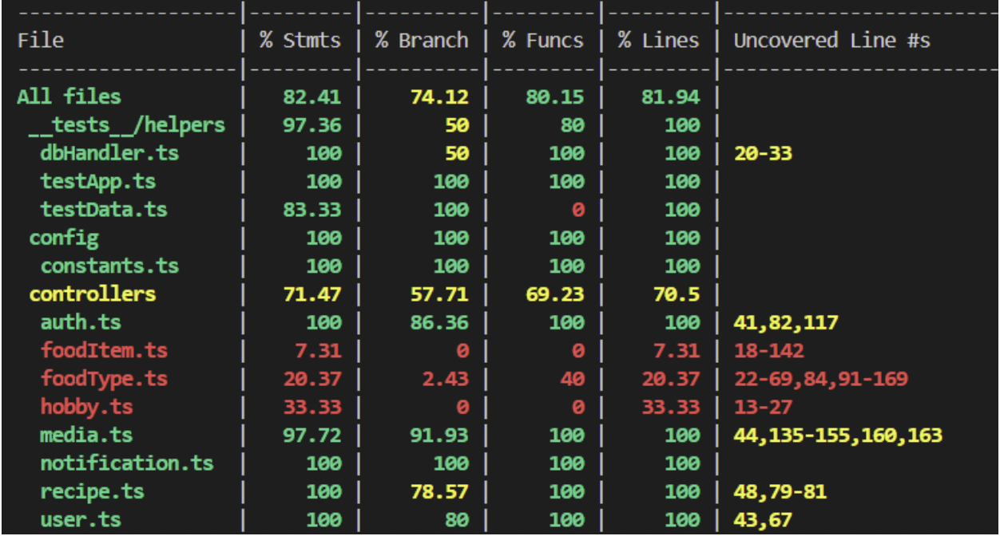
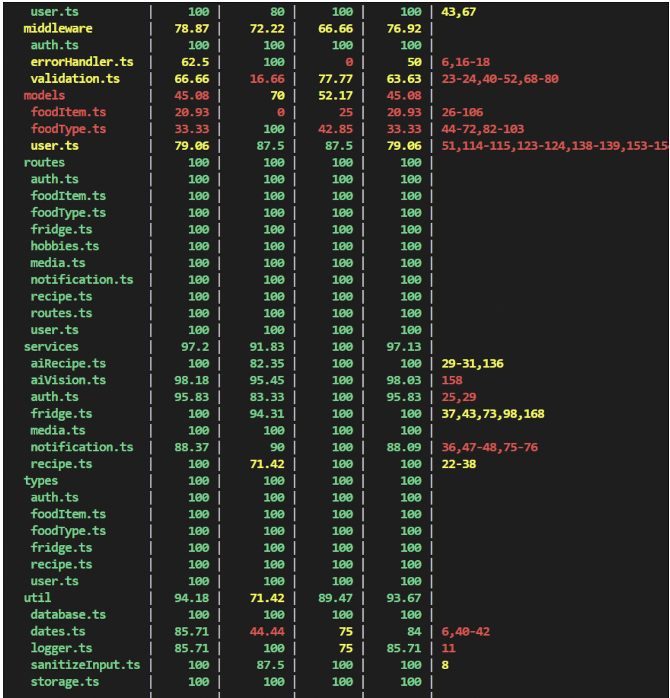
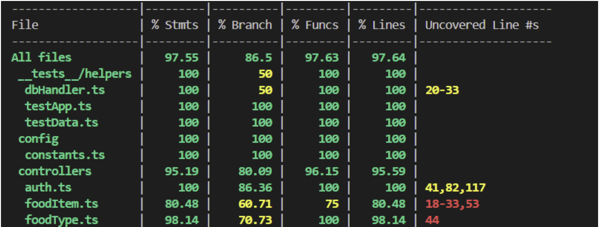
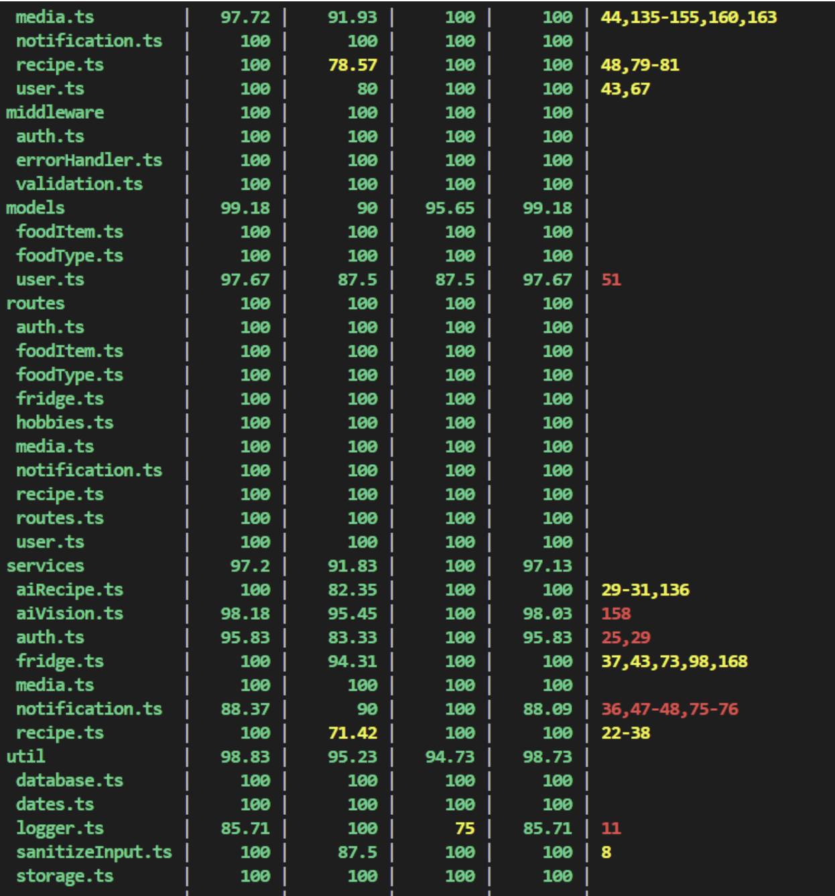
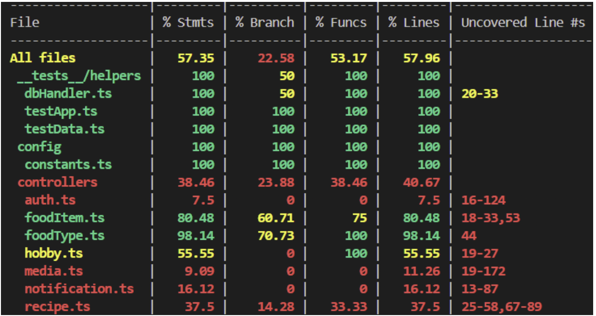
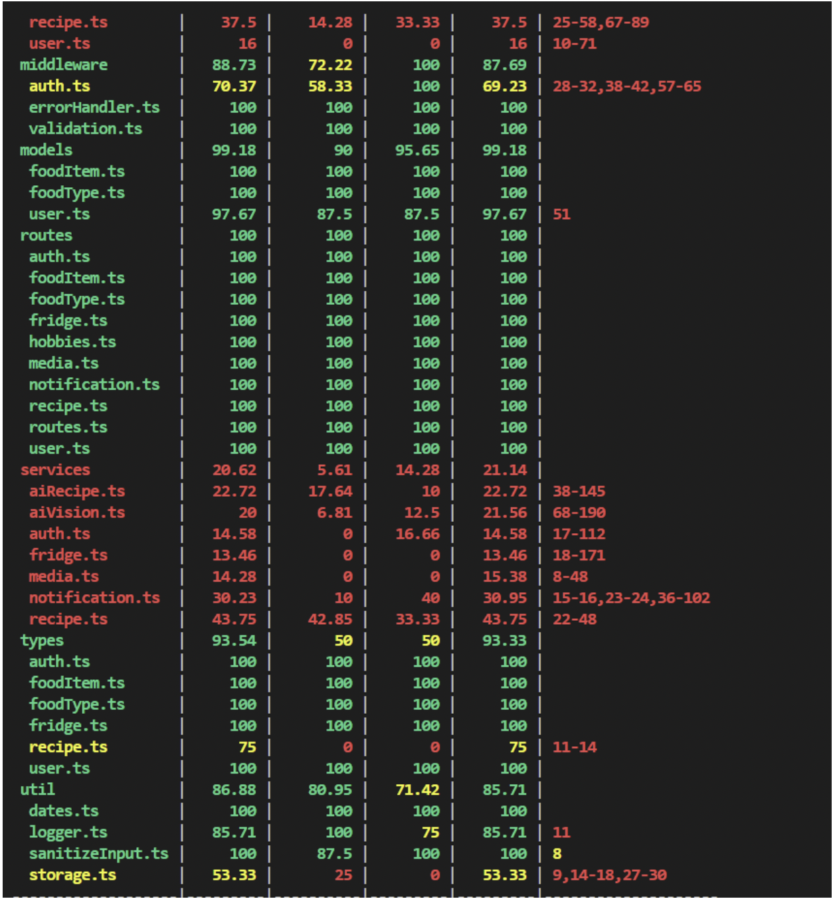
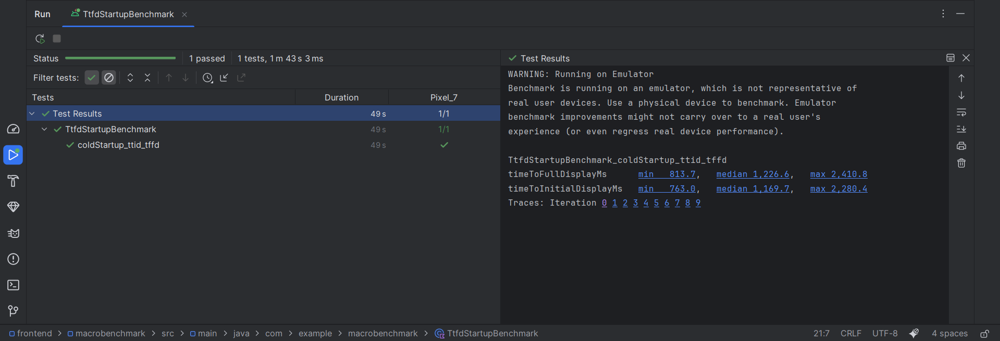
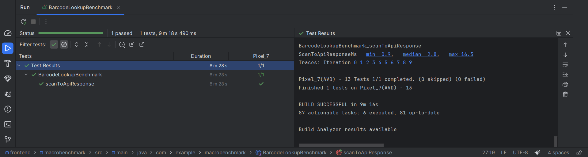
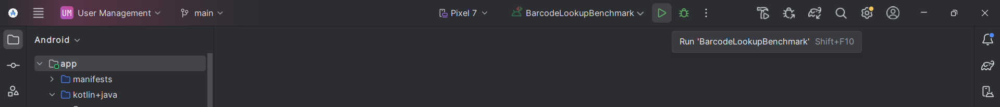

# Testing and Code Review

## 1. Change History

| **Change Date**   | **Modified Sections** |   **Rationale**  |
| ----------------- | --------------------- | -----------------|
| 27/11/25          | 2.1.1, 2.1.2, 2.1.3   | Updated to match

---

## 2. Back-end Test Specification: APIs

### 2.1. Locations of Back-end Tests and Instructions to Run Them

#### 2.1.1. Tests

| **Interface**                        | **Describe Group Location, No Mocks**                                          | **Describe Group Location, With Mocks**                                          | **Mocked Components**                    |
| ------------------------------------ | ------------------------------------------------------------------------------ | -------------------------------------------------------------------------------- | ---------------------------------------- |
| **POST /api/auth/google**            | N/A                                                                            | [`backend/src/__tests__/api-mocked/auth.test.ts#L32`](../backend/src/__tests__/api-mocked/auth.test.ts#L32) | Google OAuth2Client                      |
| **POST /api/auth/signup**            | N/A                                                                            | [`backend/src/__tests__/api-mocked/auth.test.ts#L299`](../backend/src/__tests__/api-mocked/auth.test.ts#L299) | Google OAuth2Client                      |
| **POST /api/auth/signin**            | N/A                                                                            | [`backend/src/__tests__/api-mocked/auth.test.ts#L570`](../backend/src/__tests__/api-mocked/auth.test.ts#L570) | Google OAuth2Client                      |
| **GET /api/user/profile**            | N/A                                                                            | [`backend/src/__tests__/api-mocked/user.test.ts`](../backend/src/__tests__/api-mocked/user.test.ts) | In-memory MongoDB                        |
| **POST /api/user/profile**           | N/A                                                                            | [`backend/src/__tests__/api-mocked/user.test.ts`](../backend/src/__tests__/api-mocked/user.test.ts) | In-memory MongoDB                        |
| **DELETE /api/user**                 | N/A                                                                            | [`backend/src/__tests__/api-mocked/user.test.ts`](../backend/src/__tests__/api-mocked/user.test.ts) | In-memory MongoDB                        |
| **POST /api/food-item**              | [`backend/src/__tests__/api-unmocked/foodItem.test.ts`](../backend/src/__tests__/api-unmocked/foodItem.test.ts) | [`backend/src/__tests__/api-mocked/foodItem.test.ts`](../backend/src/__tests__/api-mocked/foodItem.test.ts) | In-memory MongoDB                        |
| **PATCH /api/food-item/:id**         | [`backend/src/__tests__/api-unmocked/foodItem.test.ts`](../backend/src/__tests__/api-unmocked/foodItem.test.ts) | [`backend/src/__tests__/api-mocked/foodItem.test.ts`](../backend/src/__tests__/api-mocked/foodItem.test.ts) | In-memory MongoDB                        |
| **GET /api/food-item/:id**           | [`backend/src/__tests__/api-unmocked/foodItem.test.ts`](../backend/src/__tests__/api-unmocked/foodItem.test.ts) | [`backend/src/__tests__/api-mocked/foodItem.test.ts`](../backend/src/__tests__/api-mocked/foodItem.test.ts) | In-memory MongoDB                        |
| **DELETE /api/food-item/:id**        | [`backend/src/__tests__/api-unmocked/foodItem.test.ts`](../backend/src/__tests__/api-unmocked/foodItem.test.ts) | [`backend/src/__tests__/api-mocked/foodItem.test.ts`](../backend/src/__tests__/api-mocked/foodItem.test.ts) | In-memory MongoDB                        |
| **GET /api/fridge**                  | [`backend/src/__tests__/api-unmocked/fridge.test.ts`](../backend/src/__tests__/api-unmocked/fridge.test.ts) | [`backend/src/__tests__/api-mocked/fridge.test.ts`](../backend/src/__tests__/api-mocked/fridge.test.ts) | In-memory MongoDB                        |
| **POST /api/food-type**              | [`backend/src/__tests__/api-unmocked/foodType.test.ts`](../backend/src/__tests__/api-unmocked/foodType.test.ts) | [`backend/src/__tests__/api-mocked/foodType.test.ts`](../backend/src/__tests__/api-mocked/foodType.test.ts) | In-memory MongoDB                        |
| **GET /api/food-type**               | [`backend/src/__tests__/api-unmocked/foodType.test.ts`](../backend/src/__tests__/api-unmocked/foodType.test.ts) | [`backend/src/__tests__/api-mocked/foodType.test.ts`](../backend/src/__tests__/api-mocked/foodType.test.ts) | In-memory MongoDB                        |
| **GET /api/food-type/:id**           | [`backend/src/__tests__/api-unmocked/foodType.test.ts`](../backend/src/__tests__/api-unmocked/foodType.test.ts) | [`backend/src/__tests__/api-mocked/foodType.test.ts`](../backend/src/__tests__/api-mocked/foodType.test.ts) | In-memory MongoDB                        |
| **GET /api/food-type/barcode/:id**   | [`backend/src/__tests__/api-unmocked/foodType.test.ts`](../backend/src/__tests__/api-unmocked/foodType.test.ts) | [`backend/src/__tests__/api-mocked/foodType.test.ts`](../backend/src/__tests__/api-mocked/foodType.test.ts) | In-memory MongoDB                        |
| **PATCH /api/food-type/:id**         | [`backend/src/__tests__/api-unmocked/foodType.test.ts`](../backend/src/__tests__/api-unmocked/foodType.test.ts) | [`backend/src/__tests__/api-mocked/foodType.test.ts`](../backend/src/__tests__/api-mocked/foodType.test.ts) | In-memory MongoDB                        |
| **DELETE /api/food-type/:id**        | [`backend/src/__tests__/api-unmocked/foodType.test.ts`](../backend/src/__tests__/api-unmocked/foodType.test.ts) | [`backend/src/__tests__/api-mocked/foodType.test.ts`](../backend/src/__tests__/api-mocked/foodType.test.ts) | In-memory MongoDB                        |
| **POST /api/notifications/check**    | N/A                                                                            | [`backend/src/__tests__/api-mocked/notification-check.test.ts`](../backend/src/__tests__/api-mocked/notification-check.test.ts) | Firebase Admin SDK, In-memory MongoDB    |
| **POST /api/notifications/admin/trigger** | [`backend/src/__tests__/api-unmocked/notification-admin.test.ts`](../backend/src/__tests__/api-unmocked/notification-admin.test.ts) | [`backend/src/__tests__/api-mocked/notification-admin.test.ts`](../backend/src/__tests__/api-mocked/notification-admin.test.ts) | Firebase Admin SDK, In-memory MongoDB    |
| **POST /api/media/upload**           | [`backend/src/__tests__/api-unmocked/media.test.ts`](../backend/src/__tests__/api-unmocked/media.test.ts) | [`backend/src/__tests__/api-mocked/media.test.ts`](../backend/src/__tests__/api-mocked/media.test.ts) | File system (multer), Storage service    |
| **POST /api/media/analyze-produce**  | [`backend/src/__tests__/api-unmocked/ai-vision.test.ts`](../backend/src/__tests__/api-unmocked/ai-vision.test.ts) | [`backend/src/__tests__/api-mocked/media.test.ts`](../backend/src/__tests__/api-mocked/media.test.ts) | Gemini AI Vision API                     |
| **GET /api/recipes**                 | N/A                                                                            | [`backend/src/__tests__/api-mocked/recipe.test.ts#L44`](../backend/src/__tests__/api-mocked/recipe.test.ts#L44) | TheMealDB API (axios)                    |
| **POST /api/recipes/ai**             | N/A                                                                            | [`backend/src/__tests__/api-mocked/recipe.test.ts#L91`](../backend/src/__tests__/api-mocked/recipe.test.ts#L91) | Gemini AI API (axios)                    |

#### 2.1.2. Commit Hash Where Tests Run

`65ed7f775bd9e57ad305cfe426c20ae9ea81bfb8`

#### 2.1.3. Explanation on How to Run the Tests

1. **Clone the Repository**:

   - Open your terminal and run:
     ```bash
     git clone https://github.com/virtualfridge/virtualfridge.git
     cd virtualfridge/backend
     ```

2. **Install Dependencies**:

   - Run the following command to install all required packages:
     ```bash
     npm install
     ```

3. **Set Up Environment Variables**:

   - Create a `.env.test` file in the `backend` directory with the required environment variables:
     ```
     JWT_SECRET=test-jwt-secret
     GOOGLE_CLIENT_ID=test-google-client-id
     GEMINI_API_KEY=test-gemini-api-key
     ```
   - **Note**: Tests use an in-memory MongoDB database, so MongoDB connection variables are not required for testing.

4. **Run All Tests**:

   - To run all tests in the test suite:
     ```bash
     npm test
     ```

5. **Run All API Tests (Both Mocked and Unmocked)**:

   - To run all API tests (both mocked and unmocked):
     ```bash
     npm run test:api
     ```

6. **Run Only Mocked API Tests**:

   - To run only API tests with external service mocking:
     ```bash
     npm run test:api-mocked
     ```

7. **Run Only Unmocked API Tests**:

   - To run only API tests without external service mocking:
     ```bash
     npm run test:api-unmocked
     ```

8. **Run Tests with Coverage**:

   - To run all tests with coverage report:
     ```bash
     npm run test:coverage
     ```
   - For all API tests with coverage (both mocked and unmocked):
     ```bash
     npm run test:coverage:api
     ```
   - For mocked API tests with coverage:
     ```bash
     npm run test:coverage:api-mocked
     ```
   - For unmocked API tests with coverage:
     ```bash
     npm run test:coverage:api-unmocked
     ```

9. **Run Tests in Watch Mode**:

   - To run all tests in watch mode (automatically re-runs on file changes):
     ```bash
     npm run test:watch
     ```
   - For mocked API tests in watch mode:
     ```bash
     npm run test:watch:api-mocked
     ```
   - For unmocked API tests in watch mode:
     ```bash
     npm run test:watch:api-unmocked
     ```

10. **View Test Results**:
   - Test results will be displayed in the terminal

### 2.2. GitHub Actions Configuration Location

`~/.github/workflows/backend-tests.yml`

### 2.3. Jest Coverage Report Screenshots for Tests Without Mocking




### 2.4. Jest Coverage Report Screenshots for Tests With Mocking




### 2.5. Jest Coverage Report Screenshots for Both Tests With and Without Mocking




---

## 3. Test Specification: Tests of Non-Functional Requirements

### 3.1. Test Locations in Git

| **Non-Functional Requirement**  | **Location in Git**                              |
| ------------------------------- | ------------------------------------------------ |
| **Time to Full Display (TTFD) Benchmark**          | [`frontend/macrobenchmark/src/main/java/com/example/macrobenchmark/TtfdStartupBenchmark.kt`](../frontend/macrobenchmark/src/main/java/com/example/macrobenchmark/TtfdStartupBenchmark.kt) |
| **Barcode Lookup Benchmark** | [`frontend/macrobenchmark/src/main/java/com/example/macrobenchmark/BarcodeLookupBenchmark.kt`](../frontend/macrobenchmark/src/main/java/com/example/macrobenchmark/BarcodeLookupBenchmark.kt) |

### 3.2. Test Verification and Logs

- **Time to Full Display (TTFD) Benchmark**

  - **Verification:** This test simulates a user starting the app multiple times from a cold boot state. The test launches and quits the app repeatedly over 10 iterations, where the minimum, median, and max time is calculated between the startup intent to the time to fully display the app.
  - **Log Output**
  Below is what the expected output should be, where you can see the minimum, median, and max loading time from the iterations in milliseconds.
  


- **Barcode Lookup Benchmark**
  - **Verification:** This test simulates a user logging into the app and sending a barcode API request. It is done over 10 iterations, where the minimum, median, and max time are displayed in milliseconds. The minimum, median, and max time is calculated between the moment the test barcode button is clicked to the time to receive the API call back.
  - **Log Output**
Below is what the expected output should be, where you can see the minimum, median, and max loading time from the iterations in milliseconds.



- **Running the Tests:** To runs the tests, open the `frontend` folder as a project in Android Studio. Running the app normally and ensure that only one Google account is logged into the phone. Then select the appropriate test (see screenshot below).



---

## 4. Front-end Test Specification

### 4.1. Location in Git of Front-end Test Suite:

`frontend/app/src/androidTest/java/com/cpen321/usermanagement/e2e/`

### 4.2. Tests

- **Use Case: Log Food via Barcode**

  - **Expected Behaviors:**

    | **Scenario Steps** | **Test Case Steps** |
    | ------------------ | ------------------- |
    | 1. The user chooses the barcode scan option from “Add Food.”<br>2. The app opens the scanner interface.<br>3–5. The barcode is captured, decoded, and product data is pulled from Open Food Facts.<br>6–9. The confirmation UI appears, the user confirms, the item is added, and the fridge refreshes. | `SimpleE2ETest#test02_navigateToTestBarcodeScreen` waits for the Virtual Fridge home screen and taps the Test bottom-bar action to open the Test Barcode screen (standing in for the scan entry point).<br>`LogFoodViaBarcodeE2ETest#testLogFoodViaBarcode_screenElementsExist` asserts that the Test Barcode title, instructional copy, and “Send Test Barcode” action render.<br>`LogFoodViaBarcodeE2ETest#testLogFoodViaBarcode_successScenario` taps “Send Test Barcode,” waits for “Product Details,” and asserts the “Name” field to verify the data fetch.<br>`LogFoodViaBarcodeE2ETest#testLogFoodViaBarcode_buttonStatesDuringLoading` confirms the button is enabled before sending and shows “Sending…” while awaiting the backend.<br>(Steps 6–9 are currently validated manually; the canned Nutella flow does not expose the confirm-and-insert UI.) |
    | 2a. The user cancels scanning via the back button. | `LogFoodViaBarcodeE2ETest#testLogFoodViaBarcode_cancelNavigation` presses the device back key on the Test Barcode screen and asserts “Virtual Fridge” is visible while “Test Barcode” disappears. |
    | 4a. Barcode unreadable/damaged → prompt to re-scan. | Not yet automated (requires scanner error injection). |
    | 5a. Product not found → notify user and offer alternate methods. | Not yet automated (requires backend error mock). |

  - **Test Logs:**
    ```
    Finished 22 tests on Pixel_7(AVD) - 13
    [XmlResultReporter]: XML test result file generated at /Users/danielding/Desktop/CPEN321/virtualfridge/frontend/app/build/outputs/androidTest-results/connected/debug/TEST-Pixel_7(AVD) - 13-_app-.xml. Total tests 22, passed 22, 
    信息: Execute com.cpen321.usermanagement.e2e.LogFoodViaBarcodeE2ETest.testLogFoodViaBarcode_cancelNavigation: PASSED
    信息: Execute com.cpen321.usermanagement.e2e.LogFoodViaBarcodeE2ETest.testLogFoodViaBarcode_successScenario: PASSED
    信息: Execute com.cpen321.usermanagement.e2e.LogFoodViaBarcodeE2ETest.testLogFoodViaBarcode_buttonStatesDuringLoading: PASSED
    信息: Execute com.cpen321.usermanagement.e2e.LogFoodViaBarcodeE2ETest.testLogFoodViaBarcode_screenElementsExist: PASSED
    ```

- **Use Case: View Fridge**

  - **Expected Behaviors:**

    | **Scenario Steps** | **Test Case Steps** |
    | ------------------ | ------------------- |
    | 1. The user navigates to the home page (Virtual Fridge).<br>2. The system shows the fridge inventory. | `SimpleE2ETest#test01_appLaunchesSuccessfully` waits for “Virtual Fridge” after the LOADING/AUTH flow to ensure the main screen is visible.<br>`ViewFridgeE2ETest#testViewFridge_mainScreenSuccess` asserts either the stocked fridge list or the empty-state copy renders once the title is present. |
    | 1a. Inventory is empty → show “No food logged. Add items to view inventory.” | `ViewFridgeE2ETest#testViewFridge_emptyState` checks for the empty-state message (“Your Virtual Fridge is waiting to be filled! … Scan button”) displayed by `MainScreen.EmptyFridgeContent`. |
    | 2a. A network error prevents loading → show “Could not connect to VirtualFridge service. Try again later.” | Not yet automated (requires forcing `FridgeViewModel` into its error branch). |

  - **Supplementary Sorting & UI Behaviors:**

    | **Scenario Steps** | **Test Case Steps** |
    | ------------------ | ------------------- |
    | Sort options cycle through Expiration Date / Added Date / Name / Nutritional Value. | `ViewFridgeE2ETest#testViewFridge_sortByExpirationDate`, `…_sortByAddedDate`, `…_sortByName`, and `…_sortByNutritionalValue` tap the sort button and assert that each label remains selected after the dropdown closes. |
    | Bottom navigation stays visible (Scan/Test/Recipe/Notify). | `ViewFridgeE2ETest#testViewFridge_bottomBarButtons` asserts all four bottom-bar buttons exist after the UI idles. |

  - **Test Logs:**
    ```
    Finished 22 tests on Pixel_7(AVD) - 13
    [XmlResultReporter]: XML test result file generated at /Users/danielding/Desktop/CPEN321/virtualfridge/frontend/app/build/outputs/androidTest-results/connected/debug/TEST-Pixel_7(AVD) - 13-_app-.xml. Total tests 22, passed 22, 
    信息: Execute com.cpen321.usermanagement.e2e.ViewFridgeE2ETest.testViewFridge_mainScreenSuccess: PASSED
    信息: Execute com.cpen321.usermanagement.e2e.ViewFridgeE2ETest.testViewFridge_sortByExpirationDate: PASSED
    信息: Execute com.cpen321.usermanagement.e2e.ViewFridgeE2ETest.testViewFridge_sortByName: PASSED
    信息: Execute com.cpen321.usermanagement.e2e.ViewFridgeE2ETest.testViewFridge_emptyState: PASSED
    信息: Execute com.cpen321.usermanagement.e2e.ViewFridgeE2ETest.testViewFridge_bottomBarButtons: PASSED
    信息: Execute com.cpen321.usermanagement.e2e.ViewFridgeE2ETest.testViewFridge_sortByNutritionalValue: PASSED
    信息: Execute com.cpen321.usermanagement.e2e.ViewFridgeE2ETest.testViewFridge_sortByAddedDate: PASSED
    ```

- **Use Case: Find Recipe Suggestions**

  - **Expected Behaviors:**

    | **Scenario Steps** | **Test Case Steps** |
    | ------------------ | ------------------- |
    | 1. User selects ingredient(s) from the fridge inventory.<br>2. User taps the Recipe button. | `FindRecipeSuggestionsE2ETest#testFindRecipeSuggestions_recipeButtonDisabledWithoutSelection` waits for the main screen and verifies the Recipe button is disabled until items are selected.<br>`…recipeOptionsSheetOpens` adds a Nutella test item, selects it, taps Recipe, and asserts the “Choose Your Recipe Style” bottom sheet with “Recipe Database” and “AI Chef” choices appears. |
    | 3–5. The system requests recipes via TheMealDB and shows results (or a “No Recipes Found” fallback). | `…mealDBGeneration` selects a fridge item, chooses “Recipe Database,” and waits for either the “Fetching recipes from MealDB…,” “Recipes from MealDB,” or “No Recipes Found” text displayed inside `RecipeResultsBottomSheet`. |
    | 6. User opens a recipe link. | Not yet automated (current tests only verify the cards render; they don’t tap through to external content). |
    | Failure 3a. No recipes match → notify user. | Covered by `…mealDBGeneration` when the UI shows the “No Recipes Found” card. |
    | Failure 3b/3c. API unreachable or no internet → show the corresponding error messages. | Not yet automated (requires API/network fault injection). |
    | Gemini AI alternative success path. | `…aiGeneration` selects “AI Chef,” waits for “Generating AI recipe with Gemini…” and asserts the “AI Chef Recipe” section renders. |
    | Recipe sheet can be dismissed without side effects. | `…dismissRecipeSheet` opens the sheet, presses back, and confirms the sheet text disappears while “Virtual Fridge” remains visible. |

  - **Test Logs:**
    ```
    Finished 22 tests on Pixel_7(AVD) - 13
    [XmlResultReporter]: XML test result file generated at /Users/danielding/Desktop/CPEN321/virtualfridge/frontend/app/build/outputs/androidTest-results/connected/debug/TEST-Pixel_7(AVD) - 13-_app-.xml. Total tests 22, passed 22, 
    信息: Execute com.cpen321.usermanagement.e2e.FindRecipeSuggestionsE2ETest.testFindRecipeSuggestions_mealDBGeneration: PASSED
    信息: Execute com.cpen321.usermanagement.e2e.FindRecipeSuggestionsE2ETest.testFindRecipeSuggestions_dismissRecipeSheet: PASSED
    信息: Execute com.cpen321.usermanagement.e2e.FindRecipeSuggestionsE2ETest.testFindRecipeSuggestions_recipeOptionsSheetOpens: PASSED
    信息: Execute com.cpen321.usermanagement.e2e.FindRecipeSuggestionsE2ETest.testFindRecipeSuggestions_recipeButtonDisabledWithoutSelection: PASSED
    信息: Execute com.cpen321.usermanagement.e2e.FindRecipeSuggestionsE2ETest.testFindRecipeSuggestions_bottomBarButtonsExist: PASSED
    信息: Execute com.cpen321.usermanagement.e2e.FindRecipeSuggestionsE2ETest.testFindRecipeSuggestions_aiGeneration: PASSED
    ```


---

## 5. Automated Code Review Results

### 5.1. Commit Hash Where Codacy Ran

`65ed7f775bd9e57ad305cfe426c20ae9ea81bfb8`

### 5.2. Unfixed Issues per Codacy Category

https://app.codacy.com/gh/virtualfridge/virtualfridge/dashboard

### 5.3. Unfixed Issues per Codacy Code Pattern

https://app.codacy.com/gh/virtualfridge/virtualfridge/issues/current

### 5.4. Justifications for Unfixed Issues

- **Code Pattern: [Disallow Unsafe Argument Usage](#)**
  - **Location in Git:** [`backend/src`](#) (throughout)
  - **Justification:** Eslint, with the current configuration, does not detect types provided by libraries. So every instance of a type provided/inferred by zod (and occasionally other libraries) is considered `any` when really it should be a strongly typed value. Furthermore, in any of the indicated cases it is easy to verify in vscode or another editor that the specified type is correct.

- **Code Pattern: [Enforce Unbound Methods Are Called With Their Expected Scope](#)**
  - **Location in Git:** [`backend/src/routes`](#)
  - **Justification:** These issues are still appearing in codacy. However, the functions are all arrow functions so it should not be an issue (as per the recommended resolution steps that codacy provides).

- **Code Pattern: [Promise returned in function argument where a void return was expected.](#)**
  - **Location in Git:** [`backend/src/routes`](#)
  - **Justification:** express.js (up until the most recent version, which is supposedly unstable and we aren't using) does not provide an overload for asynchronous request handlers. They do this because there isn't proper handling of thrown errors without the user doing so explicitly. However, provided that the caller always calls next(error) or handles the error themselves, there are no issues. This is the approach we have taken for all of our request handlers that are asynchronous.

- **Code Pattern: [Detect console.log() with non Literal argument](#)
  - **Location in Git:** [`backend/src/util/logger.ts`](#)
  - **Justification:** Writing to console without a literal argument is necessary for logging. All arguments are sanitized before being written to the console. 

- **Code Pattern: [Unnecessary conditional, expected left-hand side of `??` operator to be possibly null or undefined.](#)**
  - **Location in Git**: [`backend/src/util/sanitizeInput.ts:17`](#)
  - **Justification:** JSON.stringify can actually return undefined if it fails to parse the object, for example in the case of circular references. See [the official Mozilla docs](https://developer.mozilla.org/en-US/docs/Web/JavaScript/Reference/Global_Objects/JSON/stringify#return_value). Unfortunately, the typescript prototype for the function says that it only returns a string, which is incorrect.

- **Code Pattern: [Variable Assigned to Object Injection Sink](#)**
  - **Location in Git:** [`backend/src/services/recipe.ts:134`](#)
  - **Justification:**  This is only used with the statically type-checked value `nutrient` which is, by definition, a key of the object it is indexing, so there should be no issues accessing the value from that standpoint. The reasoning behind leaving this in is that it allows us to iterate over a set of 5-10 keys in the `recipe.nutrients` object, which would otherwise result in a lot of duplicate code, so doing things this way makes the code more readable and maintainable. Furthermore, all the `nutrient` keys being passed in to the function being flagged are compile-time constants, which greatly mitigates the security risk as they are not affected by used input.

- **Code Pattern: [detect Math.random()](#)**
  - **Location in Git:** [`backend/src/util/storage.ts:17`](#)
  - **Justification:** Using Math.random() is only an issue if it is being used for security/cryptographic purposes. In this file, it is only used to create a unique filename so that when saving files they will not override each other.

- **Code pattern: [Detect Non-Literal Filename in fs Calls](#)**
  - **Location in Git:** [`backend/src/services/media.ts`](#) and [`backend/src/util/storage.ts`]
  - **Justification:** We sanitize all filenames before saving and furthermore limit them to a single, pre-determined directory to limit attack surface.
